```mermaid
flowchart TD
    Start([Sarah opens PixelBoop<br/>$0.99 iOS app]) --> GridAppears[44×24 pixel grid appears<br/>Colorful, no menus, no tutorials]

    GridAppears --> FirstReaction{What does<br/>Sarah do?}

    FirstReaction -->|Curious tap| TapPixel[Taps single pixel<br/>on melody track]
    FirstReaction -->|Hesitant| WaitObserve[Observes interface<br/>for 5-10 seconds]

    WaitObserve --> TapPixel

    TapPixel --> HearTone[Hears pleasant tone<br/>Pixel lights up brightly<br/>Visual + audio feedback]

    HearTone --> SecondAction{Next action?}

    SecondAction -->|Taps more pixels| MultiTap[Multiple pixels light up<br/>Hears different pitches<br/>Color = pitch relationship visible]
    SecondAction -->|Accidental drag| FirstDrag

    MultiTap --> PlayButton[Notices play triangle<br/>pixel icon at bottom]
    PlayButton --> PressPlay[Taps play icon]
    PressPlay --> HearsLoop[Hears her tapped notes<br/>loop in sequence]

    HearsLoop --> Moment1["💡 Realization:<br/>'I made a melody!'"]

    Moment1 --> Experiment{Wants to<br/>try more?}

    Experiment -->|Yes| FirstDrag[Drags finger horizontally<br/>across melody track]

    FirstDrag --> ArpeggioCreated[System creates arpeggio<br/>Multiple pixels light up<br/>Melodic sequence plays]

    ArpeggioCreated --> Gasp["Sarah gasps:<br/>'Wait, I didn't mess that up?'<br/>Confidence boost"]

    Gasp --> VerticalDrag[Tries vertical drag<br/>on chord track]

    VerticalDrag --> ChordCreated[System creates chord stack<br/>Vertical pixels light up<br/>Harmonic sound plays]

    ChordCreated --> PressPlayAgain[Presses play icon again]

    PressPlayAgain --> FullLoop[Hears arpeggio + chord<br/>looping together<br/>Sounds musical!]

    FullLoop --> Moment2["💡 Success:<br/>'This actually sounds good!'<br/>2 minutes elapsed"]

    Moment2 --> ContinuePlaying{Keep<br/>playing?}

    ContinuePlaying -->|Yes| KeepExploring[Continues experimenting<br/>Discovers hold-drag by accident<br/>Tries different tracks]
    ContinuePlaying -->|Save this| FindSave

    KeepExploring --> Timer[40 minutes pass<br/>In flow state]
    Timer --> ThreePatterns[Has 3 saved patterns<br/>Feeling accomplished]

    FindSave[Looks for save option] --> SaveIcon[Finds save icon<br/>at bottom of grid]
    SaveIcon --> PatternSaved[Pattern saved<br/>to library]

    PatternSaved --> ShareThought{Want to<br/>share?}

    ShareThought -->|Yes| ExportOption[Finds export button<br/>in saved patterns]
    ShareThought -->|No| ClosedApp

    ExportOption --> ExportAudio[Exports audio file<br/>Shares with boyfriend]

    ExportAudio --> NextDay[Opens PixelBoop<br/>next day at lunch<br/>'Just to play around'<br/>Becomes daily habit]

    ThreePatterns --> NextDay
    ClosedApp([Sarah closes app<br/>Feeling creative success]) --> NextDay

    NextDay --> Success([✅ User Success:<br/>Musical meditation tool<br/>Returns regularly])

    style Moment1 fill:#90EE90
    style Moment2 fill:#90EE90
    style Success fill:#32CD32
    style Gasp fill:#FFD700
```

```mermaid
flowchart TD
    Start([Marcus on train<br/>Bass line idea in head]) --> OpenApp[Opens PixelBoop<br/>Immediately focused]

    OpenApp --> ScaleSelect[Taps scale selector<br/>Chooses C minor<br/>~3 seconds]

    ScaleSelect --> BassTrack[Focuses on bass track<br/>Row 20 of grid]

    BassTrack --> TapRoot[Taps root note C<br/>on beat 1]

    TapRoot --> TapPattern[Taps E♭, G, C<br/>on beats 3, 5, 7<br/>Bass line rhythm]

    TapPattern --> QuickPlay[Presses play to verify<br/>'Yes, that's the idea'<br/>~15 seconds elapsed]

    QuickPlay --> SustainNeed{Needs sustained<br/>bass note?}

    SustainNeed -->|Yes| HoldDrag[Hold-drags on beat 7<br/>Creates sustained C<br/>through to beat 1]
    SustainNeed -->|No| AddChords

    HoldDrag --> SustainCreated[Sustained note indicator<br/>visible on grid<br/>Plays with sustain envelope]

    SustainCreated --> AddChords[Switches to chord track<br/>Row 15 of grid]

    AddChords --> ArpGesture[Quick horizontal drag<br/>on beat 1<br/>Creates Cm arpeggio]

    ArpGesture --> SecondChord[Horizontal drag<br/>on beat 5<br/>Creates G7 arpeggio]

    SecondChord --> FinalPlay[Presses play<br/>Hears full idea<br/>Bass + chords together<br/>~35 seconds elapsed]

    FinalPlay --> IdeaCaptured{Idea captured<br/>correctly?}

    IdeaCaptured -->|Yes| SavePattern[Saves pattern<br/>'Subway idea 2024-01-02'<br/>~40 seconds]
    IdeaCaptured -->|No| QuickEdit

    QuickEdit[Double-taps pixel to erase<br/>Adjusts timing] --> FinalPlay

    SavePattern --> ExportFlow[Taps saved pattern<br/>Selects 'Export JSON']

    ExportFlow --> JSONExport[Pattern data exports<br/>Note positions, timing,<br/>track assignments,<br/>scale context]

    JSONExport --> TextSelf[Texts JSON file to self<br/>'Got it - will rebuild in Ableton tonight'<br/>~50 seconds total]

    TextSelf --> CloseApp([Marcus closes app<br/>Idea preserved perfectly])

    CloseApp --> ThatEvening[Evening: Opens Ableton<br/>Imports JSON pattern data<br/>Rebuilds full production]

    ThatEvening --> ClientDemo[Two weeks later:<br/>Client loves demo<br/>that started as<br/>PixelBoop sketch]

    ClientDemo --> NewWorkflow["Marcus's new workflow:<br/>PixelBoop for ideas → Ableton for production<br/>23 patterns in 'idea bank'"]

    NewWorkflow --> Success([✅ Power User Success:<br/>Musical sketchbook<br/>Integrated into pro workflow])

    style SavePattern fill:#90EE90
    style JSONExport fill:#FFD700
    style Success fill:#32CD32
    style TextSelf fill:#90EE90
```

```mermaid
flowchart TD
    Start([Jamie in Zoom meeting<br/>Camera off, restless hands]) --> OpenApp[Opens PixelBoop<br/>Needs hand activity]

    OpenApp --> RandomTap[Taps random pixel<br/>Not thinking, just acting]

    RandomTap --> SeeHear[Sees pixel light up<br/>Hears tone<br/>Tactile + visual + audio]

    SeeHear --> MoreTaps[Taps more pixels<br/>Watching colors<br/>Hearing pitches]

    MoreTaps --> DragDiscover[Finger slides accidentally<br/>Creates drag gesture]

    DragDiscover --> PatternEmerges[Multiple pixels appear<br/>Hears melodic phrase<br/>'Oh, that's cool']

    PatternEmerges --> TapDragLoop{What feels<br/>good next?}

    TapDragLoop -->|Tap pixels| AddMoreNotes[Adds more notes<br/>No plan, just tactile play]
    TapDragLoop -->|Drag again| AnotherPhrase[Creates another phrase<br/>Different color/sound]
    TapDragLoop -->|Press play| HearLoop

    AddMoreNotes --> TapDragLoop
    AnotherPhrase --> TapDragLoop

    HearLoop[Presses play<br/>Hears pattern loop] --> ListenLoop[Listens while adding more<br/>Real-time audio feedback<br/>Tap-drag-listen-tap cycle]

    ListenLoop --> FlowState["⚡ Flow state begins:<br/>Hands busy<br/>Mind calm<br/>Sensory loop engaged"]

    FlowState --> AccidentalScrub[Gets frustrated<br/>with one section<br/>Rapidly scrubs left-right]

    AccidentalScrub --> ScrubClear[Section clears!<br/>Perlin noise reverse fill<br/>Very quick discrete pixels]

    ScrubClear --> Laugh["Jamie laughs:<br/>'That's so satisfying!'<br/>Dopamine reward"]

    Laugh --> HuntGestures{Curiosity:<br/>More hidden<br/>gestures?}

    HuntGestures -->|Try double-tap| DoubleTap[Double-taps pixel<br/>Single note erases<br/>Silent, visual-only]
    HuntGestures -->|Try hold-drag| HoldDrag[Hold-drags pixel<br/>Sustained note appears]
    HuntGestures -->|Keep playing| ContinueLoop

    DoubleTap --> Discovery1["💡 'Found another one!'<br/>Discovery dopamine hit"]
    HoldDrag --> Discovery2["💡 'Ooh, what's this?'<br/>Experimentation joy"]

    Discovery1 --> ContinueLoop
    Discovery2 --> ContinueLoop

    ContinueLoop[Continues playing<br/>No awareness of time<br/>Fully absorbed]

    ContinueLoop --> Timer[20 minutes pass<br/>Meeting ends]

    Timer --> Realize["Jamie realizes:<br/>'I feel... calm?'<br/>Not trying to meditate<br/>Just happened"]

    Realize --> CheckPattern[Looks at pattern created<br/>Repetitive, trance-like<br/>Wasn't trying to 'make music'<br/>Music happened as side effect]

    CheckPattern --> SaveDecision{Save this<br/>session?}

    SaveDecision -->|Yes| SavePattern[Saves pattern<br/>'Stim session 1']
    SaveDecision -->|No| CloseApp

    SavePattern --> NextMeeting[Next Zoom meeting:<br/>Opens PixelBoop again<br/>Same calming effect]

    CloseApp([Closes app<br/>Feels less anxious]) --> NextMeeting

    NextMeeting --> Habit[Opens PixelBoop<br/>during every meeting<br/>7 patterns saved<br/>'Stim sessions' collection]

    Habit --> PartnerNotices[Partner notices:<br/>'You seem less anxious lately'<br/>Jamie credits PixelBoop]

    PartnerNotices --> Success([✅ Flow State Success:<br/>Meditative tool<br/>Multi-sensory regulation<br/>Accidental music learning])

    style FlowState fill:#90EE90
    style Laugh fill:#FFD700
    style Discovery1 fill:#FFD700
    style Discovery2 fill:#FFD700
    style Realize fill:#90EE90
    style Success fill:#32CD32
```

# UX Design Specification pixelboop

**Author:** Myles
**Date:** 2026-01-02

---

<!-- UX design content will be appended sequentially through collaborative workflow steps -->

## Executive Summary

### Project Vision

PixelBoop is a gesture-based music sequencer that transforms spatial touch interactions on a 44×24 pixel grid into musically coherent output. Positioned as "an instrument that feels like a game, disguised as a toy, that teaches music accidentally," it occupies the white space between overly simple music toys and overwhelmingly complex professional DAWs.

The product embodies constraint-driven creativity: the 44×24 grid limitation becomes a feature, forcing melodic thinking over track accumulation. Through discovery-driven UX design, users learn by experimentation rather than instruction - each hidden gesture discovery (hold-drag for sustain, scrub-to-clear, double-swipe-undo) delivers dopamine rewards that make mastery feel like achievement.

**Platform Strategy:**
- Phase 1: Web PWA (pixelboop.audiolux.app) - rapid validation with <20ms audio latency
- Phase 2: iOS native app ($0.99 App Store) - <10ms latency with AVFoundation + C++ audio
- Phase 3: Kickstarter-funded expansion - MIDI I/O, hardware controllers, live performance mode

**Core Innovation:** Discovery-driven UX paradigm where the gesture vocabulary itself is a composable language. New features emerge from combining and extending existing gesture primitives rather than adding menu-based complexity.

### Target Users

PixelBoop serves a spectrum of users with distinct but overlapping needs:

**1. Intimidated Beginners (Sarah Santos archetype)**
- Currently overwhelmed by traditional DAWs (GarageBand feels incomprehensible)
- Need zero-barrier entry with immediate musical gratification
- Success metric: Creates first "sounds good" pattern within 2 minutes
- UX priority: No tutorials required, can't make "wrong" notes

**2. Professional Producers (Marcus Chen archetype)**
- Need rapid mobile sketching tool for capturing ideas during commute
- Success metric: 16-bar loop captured in <60 seconds
- UX priority: Gestural efficiency, pattern export to DAW, musical intelligence

**3. Sensory Seekers (Jamie Lee archetype)**
- ADHD/neurodivergent users seeking multi-sensory flow state
- Success metric: 20+ minutes of engaged "stim session" creation
- UX priority: Tactile-visual-audio feedback loop, satisfying gestural interactions, immediate response

**4. Pattern Thinkers (Dev Patel archetype)**
- Need spatial/visual representation to understand music theory
- Success metric: Learns I-IV-V progressions through grid experimentation
- UX priority: Grid as data structure, color-coded pitch relationships, logical gesture rules

**5. Performance Artists (Alex Rivera archetype)**
- Electronic musicians seeking live performance instrument potential
- Success metric: Live performance capability with hardware controllers
- UX priority: Expressive gestures (velocity, sustain, pressure), scene management, performance-oriented controls

**6. Constraint-Driven Creators (River Nakamura archetype)**
- Nostalgic for Game Boy/PICO-8 constraint-based creativity
- Success metric: Speedrun challenges, hidden gesture discoveries
- UX priority: Retro aesthetic, discovery-driven mastery, social sharing

### Key Design Challenges

**1. Gesture Language as Extensible System**

The core UX challenge is designing a gesture vocabulary that functions as a **composable language** rather than a fixed set of commands. New features must emerge from combining existing gesture primitives without requiring mode switches or menu navigation.

**Example: Arpeggiator (Future Feature)**
- Current: Vertical drag = chord, horizontal drag = single arpeggio phrase
- Future: Vertical drag → hold + drag up/down/up-down → sets arp pattern → hold + drag left/right → sets arp length (4/8/16 beats)
- Post-creation editing:
  - Drag on end note → lengthen/shorten arp
  - Drag left/right on middle notes → adjust note density
  - Drag up/down on arp → transpose voicing (scale-snapped)
  - Single tap individual note → mute/unmute (non-destructive)
  - Double-tap → delete entire arp

This demonstrates the principle: **new complexity through gesture composition, not feature addition**.

**Design Requirements:**
- Gesture state machine must support multi-step hold sequences
- Visual feedback system must indicate gesture "mode" (tooltip: "CHORD" → "ARP UP" → "LENGTH 8")
- Note grouping concept (arp/chord as bundle) for batch operations
- Visual affordances (brighter start/end pixels indicate connected sequence)
- Non-destructive editing (mute vs. delete)

**2. Discovery-Driven Learning vs. Discoverability Frustration**

Balancing hidden features (dopamine rewards) against user frustration (can't find basic functionality).

**Challenges:**
- How do users discover hold-drag = sustain without being told?
- When does "hidden" cross into "unusable"?
- How to provide gentle affordances without destroying discovery joy?

**Design Strategies:**
- Visual cues (pulse animations, ghost notes) hint at possibilities
- Contextual tooltips for basic gestures only (TAP, CHORD, ARPEGGIO)
- Advanced gestures (SUSTAIN, SCRUB, SWIPE-UNDO) remain hidden for discovery
- Pattern: Common actions = visible, power-user shortcuts = hidden

**3. Cross-Platform Gesture Consistency**

Identical gestural behavior across web (mouse/touch) and iOS (touch/haptics) despite different input capabilities.

**Challenges:**
- Mouse hover states don't exist on touch
- iOS haptics provide tactile feedback unavailable on web
- Timing thresholds (<300ms tap, ≥400ms hold) must feel identical
- Multi-touch simultaneous gestures vary by platform

**Design Requirements:**
- Shared gesture interpretation logic (timing windows, direction vectors, velocity)
- Platform-specific affordances enhance but don't change behavior
- Pattern export compatibility (same gesture produces same musical output)

**4. Multi-Sensory Feedback Loop Performance**

Maintaining <10ms audio latency, 60 FPS visual rendering, and immediate haptic response simultaneously.

**Challenges:**
- Audio thread priority conflicts with UI rendering
- Touch event processing can't block audio synthesis
- Visual feedback must sync with audio playback (playhead, pulse animations)

**Design Requirements:**
- Lock-free ring buffer for main ↔ audio thread communication
- Visual feedback tied to audio events, not touch events
- Haptic feedback prepared before triggering (iOS UIImpactFeedbackGenerator)

**5. Musical Intelligence as Invisible UX**

Scale snapping and automatic chord voicing must feel like "I made good music" not "the app made it for me."

**Challenges:**
- Too much correction = feels constraining, robotic
- Too little correction = beginners make discordant sounds
- Advanced users may want to break the scale

**Design Strategies:**
- Scale snapping default (ensures success) with visual cues (dimmed non-scale notes)
- Chord voicing follows musical theory but preserves user gesture intent
- Future: "chromatic mode" for advanced users (unlockable discovery?)

### Design Opportunities

**1. Gesture Vocabulary as Brand Identity**

The gesture language itself becomes PixelBoop's unique selling point - competitors have features, PixelBoop has a *language*.

**Opportunities:**
- Marketing: Show gesture combinations in app preview videos
- Community: Users share gesture discoveries, create "combo" challenges
- Educational: "Learn music through gestures" positioning
- Viral: Satisfying gesture interactions perfect for social media clips

**2. Progressive Complexity Through Composition**

Each new feature uses existing gesture primitives in new combinations, creating natural skill progression.

**Opportunities:**
- Beginner path: Tap → Drag → Hold+Drag (linear complexity)
- Power-user path: Double-gestures → Multi-step holds → Advanced editing
- No skill ceiling: Gesture mastery enables increasingly complex musical expression
- "Speedrun" community: How fast can you create X using gesture combos?

**3. Spatial Music Theory Education**

The grid becomes a learning tool where music theory is internalized through spatial experimentation.

**Opportunities:**
- Audiolux framework integration: Music education disguised as play
- Pattern recognition: "Vertical = harmony" learned through experimentation, not explanation
- Color-coded pitch relationships make chromatic scale visual
- Future: Achievement system for musical concept discoveries ("You discovered chord inversions!")

**4. Hardware Controller Integration Path**

Gesture vocabulary maps naturally to grid controllers (Launchpad, Push, Erae Touch 2).

**Opportunities:**
- Phase 3: MPE controller support with pressure-sensitive gestures
- Live performance mode: Pattern switching, gesture-based scene launching
- Studio integration: PixelBoop as rapid ideation tool before DAW production
- Competitive advantage: First gesture-based sequencer with native hardware support

**5. Constraint as Creative Catalyst**

The 44×24 grid and 4-track limit force creative problem-solving rather than feature accumulation.

**Opportunities:**
- "Pixel DAW" category positioning (like PICO-8 for games)
- Community challenges: "Make a track using only 8 steps"
- Artistic constraints drive memorable compositions
- Anti-feature-bloat philosophy attracts minimalist creators

## Core User Experience

### Defining Experience

PixelBoop's core experience is **gestural music composition where visual representation equals sonic output**. Users express musical intent through touch gestures on a 44×24 pixel grid, and the system interprets intent forgivingly rather than demanding pixel precision.

The primary user action is the **gesture-listen-see loop**: gesture (express intent) → visual appears (grid shows pattern) → audio plays (hear what you see). This cycle repeats continuously as users discover, experiment, and refine their musical ideas.

**Inverted Learning Curve:**
Unlike traditional music software where effort → learning → music theory → technical knowledge → sounds good, PixelBoop inverts this: first gesture → sounds really good → discover more → master gestures → find your voice. Musical intelligence (scale snapping, chord voicing, automatic harmony) ensures users can't sound bad, but gesture mastery enables users to sound like themselves rather than generic presets.

**Three-Phase Experience Progression:**
1. **Immediate Success (first 2 minutes)**: First gestures produce musically satisfying results without music theory knowledge
2. **Exploration (first session)**: Gesture experimentation reveals depth and hidden features through discovery
3. **Mastery (return sessions)**: Gesture fluency enables personal expression and unique musical voice

### Platform Strategy

**Primary Platform: Touch-First Mobile**
- Phase 1: Progressive Web App (pixelboop.audiolux.app) optimized for mobile browsers with touch gestures
- Phase 2: iOS native app with <10ms audio latency and haptic feedback integration
- Phase 3: Hardware controller support (Erae Touch 2, grid controllers) for live performance

**Platform Requirements:**
- Offline-first architecture (patterns created, edited, played without network)
- Cross-platform gesture consistency (web mouse/touch and iOS touch behave identically)
- Small screen optimization (gesture interpretation forgiving of imprecise touch on mobile displays)
- Real-time audio synthesis with minimal latency (<20ms web, <10ms iOS)
- 60 FPS visual rendering synchronized with audio playback
- Responsive menu column adapts to horizontal space (collapsed on compact devices, persistent on spacious devices)
- Vertical canvas fill optimization (pixel grid scales to maximize vertical screen space)

**Input Modality:**
- Touch-primary design with mouse support as secondary
- Gesture vocabulary designed for finger-sized touch targets on mobile screens
- No hover states (touch-first means all interactions work without hover)
- Multi-touch support for simultaneous gestures across tracks

### Effortless Interactions

**Musical Correctness Without Music Theory:**
- Scale snapping ensures notes sound harmonically correct automatically
- Chord voicing follows music theory rules without user knowledge required
- Automatic rhythm patterns for drum track prevent rhythmic discord
- Bass patterns follow harmonic roots without manual transposition

**Gesture Forgiveness:**
- Horizontal drag interpreted as arpeggio even if slightly diagonal
- Vertical drag creates chord even if not perfectly vertical
- Hold timing thresholds forgiving (≥400ms, not exact)
- Direction vectors interpreted broadly (not pixel-perfect angles required)

**Immediate Feedback:**
- Visual notes appear on grid the instant gesture completes
- Audio plays with <10ms latency (tap-to-sound imperceptible delay)
- Gesture tooltips appear in real-time showing interpreted action
- Undo/redo always available (50-level history enables fearless experimentation)

**What Should NOT Be Effortless (By Design):**
- Individual note editing (gestures create patterns, not manual pixel placement)
- Pixel-precise placement (small mobile pixels make this intentionally difficult)
- Manual note-by-note deletion (gestures operate on patterns, not individual notes)

### Critical Success Moments

**First-Touch Success:**
The moment where a user's first gesture produces a musically satisfying pattern that sounds good. This validates three promises simultaneously:
1. Visual-audio equivalence ("what I drew is what I hear")
2. Gesture forgiveness ("it understood my rough drag")
3. Musical intelligence ("this sounds good without music theory")

**Discovery Dopamine:**
The moment where a user accidentally discovers a hidden gesture (hold-drag for sustain, scrub-to-clear, double-swipe-undo) and realizes "there's more depth here than I thought." This creates desire to continue exploring rather than abandoning after surface understanding.

**Menu Discovery:**
The moment where a user taps the collapsed menu column and discovers the full control panel expands smoothly. This validates two promises: (1) the interface respects screen space (grid-only immersion when menu collapsed), and (2) full controls are always accessible without obscuring the creative canvas. The collapse-back gesture reinforces user control over their workspace.

**Personal Voice Emergence:**
The moment where a user creates something that sounds uniquely theirs rather than generic app output. This happens through gesture mastery - the user has internalized the gesture vocabulary and uses it fluently to express musical ideas.

**Pattern Completion:**
The moment where a user realizes "I just created a complete musical idea in under 60 seconds" without traditional DAW complexity. This validates the constraint-driven creativity promise and positions PixelBoop as rapid ideation tool.

### Experience Principles

**1. Visual-Audio Equivalence**
The grid is not a control panel, it's a visual representation of the music itself. What you see IS what you hear. No translation, no mental mapping, no abstraction layer. The pixel grid is the music made visible.

**2. Gesture Expresses Intent, Not Precision**
Gestures communicate musical ideas, not pixel coordinates. The system interprets intent forgivingly - a roughly horizontal drag means "arpeggio" regardless of diagonal imprecision. Small mobile pixels make precise placement frustrating; gesture interpretation makes it unnecessary.

**3. Discovery Through Progressive Depth**
Surface simplicity (tap, drag) conceals progressive complexity (hold-drag-sustain, multi-step arpeggiator creation, gesture combinations). Users discover features through experimentation rather than tutorials, creating dopamine rewards that fuel continued exploration.

**4. Instant Gratification, Earned Mastery**
First gestures sound really good (musical intelligence ensures success). Continued practice enables personal voice (gesture fluency enables expression). Users can't sound bad, but they can sound generic until mastery emerges.

**5. Patterns Over Pixels**
Users create musical patterns through gestures, not individual notes through pixel placement. The power lies in the gestural vocabulary (arpeggio, chord, phrase, sustain), not manual editing. Gestures are compositional tools, not drawing implements.

**6. Forgiveness Over Frustration**
Musical intelligence exists to help users succeed. Scale snapping prevents wrong notes. Chord voicing corrects harmonic stacking. Gesture interpretation understands imprecise touch. Undo enables fearless experimentation. The system assumes positive intent and helps achieve it.

**7. Composable Gesture Language**
New features emerge from combining existing gesture primitives rather than adding menu complexity. Future arpeggiator: vertical drag (chord) → hold + drag up/down (arp pattern) → hold + drag left/right (length). The gesture vocabulary is extensible through composition, not feature addition.

### Overarching Goal: Intelligent Song Structure Composition

**Vision Beyond Loop Sequencing:**
PixelBoop aims to be an intelligent compositional partner that guides users toward complete song structures, not just repeating loops. After each gesture, the system should understand:
- What musical elements exist (melodic phrase, chord progression, rhythmic pattern)
- What a complete song with these elements could be (intro, verse, chorus, bridge, drop)
- How to suggest structure and variations that move toward compositional completeness

**Song Structure Intelligence (Goals, Not Solutions):**
- System recognizes when user has created a "chorus" vs "verse" based on musical characteristics
- Bottom row blocks should represent song sections (intro/verse/chorus/bridge/drop/outro), not just timeline
- Intelligent auto-copy with musical variation (create chorus → system suggests verse with lower energy, bridge with variation, drop with build)
- User "uncovers" the song structure through gestures rather than manually arranging loops
- Default behavior: intelligence suggests and creates arrangement, user overrides with gestures when desired

**Design Challenges to Solve:**
- How does user navigate between song sections gesturally?
- How opinionated should structural suggestions be? (Strong auto-arrangement vs gentle guidance)
- How does system detect musical style/genre to inform suggestions? (EDM drop vs pop bridge)
- What gestures allow user to override or customize intelligence suggestions?
- How to visualize song structure in bottom overview rows without cluttering the interface?

**Success Criteria:**
Users should feel like they're discovering/uncovering a complete song rather than manually building loops. If users are required to decide loop counts, copy/paste sequences, or manually arrange sections, the intelligence has failed to meet the app's goals.

## Desired Emotional Response

### Primary Emotional Goals

**"Playful Confidence Through Discovery"**

PixelBoop aims to create a unique emotional state where users feel simultaneously empowered and curious. Unlike traditional music software that induces anxiety ("Am I doing this right?"), PixelBoop creates **confident experimentation** - users feel safe to explore because the system ensures they can't fail musically.

**Core Emotional Outcomes:**
1. **Creative Confidence**: "I just made something that sounds amazing without music theory knowledge"
2. **Discovery Delight**: Dopamine rewards from finding hidden gestures ("There's more here than I thought!")
3. **Flow State Engagement**: Tactile-visual-audio loop creates meditative, focused satisfaction
4. **Demystification Relief**: Music creation no longer feels gatekept or mysterious
5. **Accomplished Pride**: Rapid pattern completion validates creative capability

**The "Tell a Friend" Emotion:**
"Watch what I can do!" - Users share because they're genuinely proud of what they created in under 2 minutes, not because they learned a complex tool.

### Emotional Journey Mapping

**First Discovery (0-2 minutes):**
- **Desired**: Curiosity → Surprise → "Whoa, that sounds good!"
- **Avoid**: Confusion, overwhelm, "Where do I start?"
- **Design Support**: First gesture produces musically satisfying result immediately, gesture forgiveness ensures success

**Core Experience (First Session):**
- **Desired**: Playful experimentation → Discovery excitement → Flow state
- **Avoid**: Frustration with precision, fear of making mistakes, boredom
- **Design Support**: Hidden gestures reward exploration, undo enables fearless experimentation, multi-sensory feedback maintains engagement

**Pattern Completion:**
- **Desired**: Accomplishment → Pride → "I want to show someone"
- **Avoid**: "This sounds generic" or "I got lucky"
- **Design Support**: Gesture mastery creates personal voice, pattern ownership feels earned not algorithmic

**Return Sessions:**
- **Desired**: Anticipation → "What will I discover today?" → Deeper mastery satisfaction
- **Avoid**: "I've seen everything" or "It's just a toy"
- **Design Support**: Progressive depth through gesture combinations, no skill ceiling

**When Things Go Wrong:**
- **Desired**: "Easy to fix" confidence, trust in undo system
- **Avoid**: Panic, data loss anxiety, "I ruined it"
- **Design Support**: 50-level undo/redo, forgiving gesture interpretation, auto-save prevents loss

### Micro-Emotions

**Confidence Over Confusion:**
Every interaction should reinforce "I understand what's happening." Visual-audio equivalence means users always see what they hear - no hidden state, no mystery about where sound comes from.

**Delight Over Mere Satisfaction:**
Discovery moments create genuine delight, not just task completion. Finding hold-drag-sustain feels like uncovering a secret, not reading a manual.

**Accomplishment Over Luck:**
Users should feel "I made this through mastery" not "the app made this for me." Musical intelligence enables success, but gesture fluency creates ownership.

**Trust Over Skepticism:**
System forgiveness builds trust - roughly horizontal drag still creates arpeggio, scale snapping prevents bad notes. Users learn "this understands my intent."

**Empowerment Over Limitation:**
Constraints (4 tracks, 44×24 grid) should feel like creative focus, not artificial restriction. "This forces me to be melodic" not "I wish I had more."

**Belonging Over Isolation:**
Future community features should create "others discover gestures too" connection. Discovery becomes shared language, not solitary confusion.

### Design Implications

**For Playful Confidence:**
- Musical intelligence ensures first gestures sound good (confidence)
- Hidden gestures reward exploration (playful discovery)
- No tutorials or forced onboarding (trust users to explore)
- Gesture tooltips appear only after success (celebrate, don't instruct)

**For Discovery Delight:**
- Advanced gestures hidden from initial interface
- Visual feedback hints at possibilities (pulse animations, ghost notes)
- Success creates desire to find more ("What else can I do?")
- Pattern: Basic gestures visible, power-user shortcuts discoverable

**For Flow State:**
- <10ms audio latency prevents cognitive disruption
- 60 FPS visual rendering maintains sensory immersion
- Haptic feedback (iOS) completes tactile-visual-audio loop
- Immediate response to every gesture maintains flow

**For Creative Confidence:**
- Scale snapping prevents "wrong notes" anxiety
- Undo always available (50 levels) enables fearless experimentation
- Pattern save/auto-save prevents loss anxiety
- Export validates "this is worth keeping"

**For Accomplished Pride:**
- Gesture mastery enables personal voice (not generic presets)
- Rapid completion (<60 sec) validates efficiency
- Visual grid shows "I drew this music" ownership
- Share/export enables showing others

### Emotional Design Principles

**1. Success Before Instruction**
Users feel successful before understanding why. First gesture sounds good, understanding comes through continued play. Emotion precedes education.

**2. Discovery Rewards Curiosity**
Hidden features create dopamine hits. Finding scrub-to-clear gesture feels like achievement, not RTFM failure. Curiosity is rewarded, not punished.

**3. Forgiveness Builds Trust**
System interprets intent generously. Imprecise touch doesn't cause failure. Users learn "this understands me" rather than "I'm bad at this."

**4. Constraints Enable Focus**
Limitations feel freeing, not restrictive. 4 tracks mean "focus on melody" not "I need more tracks." Grid size forces creative decisions, not expansion.

**5. Ownership Through Mastery**
Musical intelligence enables success, gesture fluency creates uniqueness. Users progress from "this sounds good" (gratitude) to "this sounds like me" (pride).

**6. Visual-Audio Trust**
What you see IS what you hear. No hidden state, no abstraction anxiety. Complete transparency builds confidence - the grid is the music made visible.

**7. Flow Over Features**
Maintain sensory engagement over feature count. Better to have fewer gestures that feel magical than many features that require thought. Flow state is the goal, not capability checklist.

## UX Pattern Analysis & Inspiration

### Inspiring Products Analysis

#### **1. Figure (Propellerhead) - Gesture-Based Music Creation**

**What It Does Well:**
- **Immediate Sonic Gratification**: First touch produces musically correct output (scale-locked)
- **Visual-Audio Feedback Loop**: Real-time visual representation of sound being created
- **Gesture Economy**: Limited gesture vocabulary (tap, drag, twist) covers 80% of use cases
- **Session-Based Creation**: No "save/load" friction—just create and export

**UX Strengths:**
- Onboarding is experiential, not tutorial-based (discover through play)
- Navigation is minimal—single screen with layered functionality
- Errors are nearly impossible due to musical constraints
- Visual design uses color to indicate sonic properties (pitch, timbre)

**What PixelBoop Can Learn:**
- Musically intelligent constraints remove user anxiety
- Single-screen focus reduces cognitive load
- Color-coding can communicate musical properties instantly

**What to Avoid:**
- Figure's limited compositional depth (mentioned as pain point for Marcus Chen)
- Can feel "toy-like" rather than "instrument-like" after mastery

---

#### **2. PICO-8 - Constraint-as-Feature Philosophy**

**What It Does Well:**
- **Embraces Limitations**: 16-color palette, 128×128 screen become creative assets
- **Coherent Aesthetic**: Limitations create unified visual language
- **Discovery Through Exploration**: Features revealed through experimentation, not documentation
- **Community-Driven Learning**: Users teach each other through shared creations

**UX Strengths:**
- Constraints reduce decision paralysis
- Retro aesthetic creates nostalgia and warmth
- Immediate feedback loop (code → run → see result)
- Active community shares patterns and techniques

**What PixelBoop Can Learn:**
- 44×24 grid constraint can be celebrated, not apologized for
- Limitations can create distinctive aesthetic identity
- Community sharing amplifies discovery (users teach users)

**What to Avoid:**
- PICO-8's learning curve still requires coding knowledge
- Too much constraint can limit expressiveness

---

#### **3. Monument Valley - Gestural Excellence**

**What It Does Well:**
- **Gesture Clarity**: Every interactive element has clear affordance
- **Visual Forgiveness**: Gesture precision is forgiving (intent over accuracy)
- **Delight Through Discovery**: Hidden mechanics reward exploration
- **Impossible Geometry**: Visual paradox creates wonder

**UX Strengths:**
- Touch targets are generous despite detailed visuals
- Gestures feel natural and intuitive (rotate, drag, tap)
- No tutorial needed—interaction language is self-evident
- Visual beauty creates emotional engagement

**What PixelBoop Can Learn:**
- Gesture forgiveness is essential (interpret intent, not pixel precision)
- Visual clarity doesn't require sacrificing aesthetic beauty
- Discovery creates delight when tied to reward (sounds good!)
- Affordances can be subtle yet effective

**What to Avoid:**
- Monument Valley is passive/puzzle-based—PixelBoop needs active creation
- Over-tutorialization would break flow

---

#### **4. Procreate - Gesture-Based Creative Tool**

**What It Does Well:**
- **Gesture Vocabulary Mastery**: Pinch, rotate, two-finger tap, three-finger swipe
- **Contextual Gestures**: Same gesture does different things in different modes
- **Immediate Undo**: Two/three-finger tap for undo/redo removes fear
- **Progressive Disclosure**: Advanced features hidden until needed

**UX Strengths:**
- Onboarding teaches core gestures through interactive examples
- Navigation uses edge swipes (left = brushes, right = layers)
- Gesture combinations unlock power (pinch + rotate = transform)
- Visual feedback confirms gesture recognition

**What PixelBoop Can Learn:**
- Gesture vocabulary can be compositional (combine primitives)
- Immediate undo removes creative fear
- Contextual gestures maximize limited input space
- Edge gestures can provide navigation without UI clutter

**What to Avoid:**
- Too many gestures create learning burden
- Contextual gestures can confuse if not clearly differentiated

---

#### **5. Korg Gadget - iOS Music Production**

**What It Does Well:**
- **Gadget Metaphor**: Each instrument is a self-contained "gadget"
- **Immediate Playability**: Touch keyboard is always accessible
- **Visual Synthesis Parameters**: Knobs and sliders have visual feedback
- **Export Integration**: Easy sharing to other platforms

**UX Strengths:**
- Navigation between gadgets is swipe-based
- Each gadget has consistent layout (keyboard, controls, sequencer)
- Real-time parameter changes with immediate audio feedback
- Session view shows all tracks simultaneously

**What PixelBoop Can Learn:**
- Visual representation of audio parameters aids understanding
- Consistent layout across features reduces cognitive load
- Multi-track view helps users understand song structure

**What to Avoid:**
- Korg Gadget's complexity overwhelms beginners (like GarageBand)
- Too many options create decision paralysis
- Import/export friction interrupts creative flow

---

### Transferable UX Patterns

#### **Navigation Patterns:**

1. **Single-Screen Focus** (Figure, Monument Valley)
   - **Pattern**: Primary interaction happens on one persistent screen
   - **Applies to PixelBoop**: 44×24 grid stays central; all features overlay/augment
   - **Benefit**: Reduces cognitive load, maintains visual-audio connection

2. **Edge-Based Navigation** (Procreate)
   - **Pattern**: Swipe from edges to access tools/settings
   - **Applies to PixelBoop**: Left edge = track selection, right edge = settings, top = transport
   - **Benefit**: Maximizes grid visibility while providing quick access

3. **Layered Functionality** (PICO-8, Procreate)
   - **Pattern**: Same space serves multiple purposes in different modes
   - **Applies to PixelBoop**: Grid is drawing surface AND playback view AND song structure
   - **Benefit**: Constraint turns limitation into coherent design

#### **Interaction Patterns:**

1. **Gesture Forgiveness** (Monument Valley)
   - **Pattern**: Interpret user intent rather than requiring pixel precision
   - **Applies to PixelBoop**: Snap to grid, gesture smoothing, intent recognition
   - **Benefit**: Small pixels + fat fingers = forgiving system required

2. **Immediate Undo** (Procreate)
   - **Pattern**: Two/three-finger tap for instant undo/redo
   - **Applies to PixelBoop**: Three-finger tap = undo, four-finger tap = redo
   - **Benefit**: Removes fear of experimentation, encourages discovery

3. **Compositional Gestures** (Procreate)
   - **Pattern**: Combine gesture primitives to unlock advanced features
   - **Applies to PixelBoop**: Hold + drag up/down = arpeggiator pattern, hold + drag left/right = length
   - **Benefit**: Extensible gesture language without overwhelming beginners

4. **Musical Constraints** (Figure)
   - **Pattern**: System prevents musically incorrect actions
   - **Applies to PixelBoop**: Scale snapping, chord voicing, intelligent harmony
   - **Benefit**: First gesture sounds good, encourages continued exploration

5. **Adaptive Control Layout** (iOS Split View, Procreate sidebars)
   - **Pattern**: UI chrome adapts to available space without obscuring creative canvas
   - **Applies to PixelBoop**: Collapsible menu column (icon-only → full controls)
   - **Tap interaction**: Single tap toggles collapsed ↔ expanded state
   - **Hardware compatible**: No edge-swipe gestures (works with grid controllers)
   - **Benefit**: Grid-only immersion when collapsed, full controls accessible when needed, maximizes vertical canvas space

#### **Visual Patterns:**

1. **Color-Coded Sonic Properties** (Figure, Korg Gadget)
   - **Pattern**: Hue/saturation represents pitch/velocity/timbre
   - **Applies to PixelBoop**: Brighter = louder, hue = pitch/track, saturation = sustain
   - **Benefit**: Visual ↔ audio equivalence (see = hear)

2. **Constraint-as-Aesthetic** (PICO-8)
   - **Pattern**: Limitations create distinctive visual identity
   - **Applies to PixelBoop**: 44×24 grid becomes signature aesthetic, not apologized for
   - **Benefit**: Memorable identity, community recognition

3. **Progressive Disclosure** (Procreate, Korg Gadget)
   - **Pattern**: Advanced features hidden until user is ready
   - **Applies to PixelBoop**: Core gestures revealed first, advanced combinations discovered later
   - **Benefit**: Supports inverted learning curve (simple → deep)

---

### Anti-Patterns to Avoid

1. **Tutorial Hell** (Many iOS music apps)
   - **Problem**: Forced tutorials before users can experiment
   - **Why Avoid**: Breaks flow, prevents discovery, feels patronizing
   - **PixelBoop Alternative**: Experiential onboarding—first gesture teaches itself

2. **Feature Creep Overwhelm** (GarageBand, Korg Gadget)
   - **Problem**: Too many options create decision paralysis
   - **Why Avoid**: Conflicts with "immediate gratification" goal
   - **PixelBoop Alternative**: Constraint-driven design—fewer features, deeper interactions

3. **Hidden Affordances** (Many gesture apps)
   - **Problem**: Gestures discoverable only through documentation
   - **Why Avoid**: Creates frustration when users can't find features
   - **PixelBoop Alternative**: Visual hints (brighter pixels for arpeggiator start/end)

4. **Precision Requirements** (Traditional DAWs)
   - **Problem**: Requires pixel-perfect accuracy for small targets
   - **Why Avoid**: Fat fingers + small pixels = frustration
   - **PixelBoop Alternative**: Gesture forgiveness, intent interpretation, snap-to behaviors

5. **Modal Confusion** (Complex apps with mode switching)
   - **Problem**: Same gesture does unpredictable things in different modes
   - **Why Avoid**: Users lose confidence in gesture vocabulary
   - **PixelBoop Alternative**: Contextual gestures clearly differentiated (visual feedback)

6. **Save/Load Friction** (Traditional production tools)
   - **Problem**: Users must manage files, projects, sessions
   - **Why Avoid**: Interrupts creative flow, creates anxiety
   - **PixelBoop Alternative**: Auto-save everything, export when ready

---

### Design Inspiration Strategy

#### **What to Adopt:**

1. **Musical Intelligence from Figure**
   - **Adoption**: Scale snapping, chord voicing, musically correct defaults
   - **Reason**: Supports "first gesture sounds good" principle
   - **Implementation**: Built into C++ audio engine

2. **Gesture Forgiveness from Monument Valley**
   - **Adoption**: Intent recognition over pixel precision
   - **Reason**: Small pixels + touch input require forgiving system
   - **Implementation**: Gesture smoothing, snap-to-grid, directional thresholds

3. **Single-Screen Focus from Figure**
   - **Adoption**: 44×24 grid remains central to all interactions
   - **Reason**: Maintains visual-audio connection, reduces cognitive load
   - **Implementation**: Overlays/modals augment grid, never replace it

4. **Immediate Undo from Procreate**
   - **Adoption**: Three-finger tap = undo, four-finger tap = redo
   - **Reason**: Removes fear of experimentation
   - **Implementation**: Undo stack in Swift layer, gesture recognition in UIKit

#### **What to Adapt:**

1. **Compositional Gestures from Procreate**
   - **Adaptation**: Create PixelBoop-specific gesture compositions
   - **Modification**: Hold + drag combinations for arpeggiator, song structure
   - **Reason**: Extensible language without overwhelming beginners
   - **Constraint**: Limit to 3-step maximum gesture sequences

2. **Constraint-as-Feature from PICO-8**
   - **Adaptation**: Celebrate 44×24 grid as signature aesthetic
   - **Modification**: Grid size optimized for phone + musical functionality
   - **Reason**: Creates distinctive identity, aids community recognition
   - **Constraint**: Don't apologize for limitations—embrace them

3. **Progressive Disclosure from Procreate**
   - **Adaptation**: Reveal features through gestural discovery
   - **Modification**: Visual hints guide discovery (brighter pixels, subtle animations)
   - **Reason**: Supports inverted learning curve
   - **Constraint**: Balance discoverability with delight of discovery

#### **What to Avoid:**

1. **Feature Overwhelm from GarageBand/Korg Gadget**
   - **Why**: Conflicts with "immediate gratification" and "visual simplicity" goals
   - **Alternative**: Constraint-driven design—fewer features, deeper interactions

2. **Tutorial Requirements from Traditional Music Apps**
   - **Why**: Breaks flow, prevents experiential learning
   - **Alternative**: First gesture teaches itself through immediate feedback

3. **Modal Confusion from Complex Apps**
   - **Why**: Users lose confidence in gesture vocabulary
   - **Alternative**: Clear visual feedback differentiates contextual gestures

4. **Precision Requirements from DAWs**
   - **Why**: Fat fingers + small pixels = frustration
   - **Alternative**: Gesture forgiveness, snap-to behaviors, intent interpretation

---

**This inspiration strategy will guide design decisions while keeping PixelBoop unique and aligned with its core principles: visual-audio equivalence, gesture-driven discovery, and inverted learning curve.**

## Design System Foundation

### Design System Choice

**PixelBoop uses a 100% Custom Pixel-Based Design System** with zero UI elements outside the 44×24 pixel grid. This is not a traditional design system choice—it's a radical constraint that becomes the product's defining characteristic.

**Core Principle:**
> "The grid IS the interface. Every pixel serves musical purpose. Zero chrome."

This means:
- No buttons, menus, toolbars, or settings screens outside the grid
- No legends, labels, or instructional text overlaying the grid
- No status bars, navigation bars, or platform chrome
- All state, feedback, navigation, and interaction happens **within** the 44×24 pixel canvas
- Platform UI (iOS status bar, home indicator) is hidden during use

---

### Rationale for Selection

**1. Visual-Audio Equivalence Demands It**
- User principle: "What you see = what you hear"
- External UI would create abstraction layer between visual grid and sonic output
- Every pixel must represent musical data—no pixels wasted on chrome

**2. Constraint-as-Feature Identity**
- Following PICO-8 inspiration: limitations create distinctive aesthetic
- 44×24 grid is not apologized for—it's celebrated
- "Pixel purity" becomes brand differentiator and community rallying point

**3. Discovery-Driven UX Requires It**
- No tutorials or instructional UI means no external guidance layer
- Users discover through experimentation with the grid itself
- Visual hints must exist **within** pixels (brighter affordances, subtle animations)

**4. Gesture-Only Interaction Enables It**
- No buttons to click = no need for button UI
- All controls accessed through gestures on/around the grid
- Edge swipes, multi-finger taps, hold gestures replace traditional menus

**5. Platform Consistency Challenge Becomes Strength**
- Web and iOS versions both show **only** the pixel grid
- No platform-specific UI conventions to reconcile
- Identical visual experience across all platforms

---

### Implementation Approach

**Core Rendering System:**
- **Grid Canvas**: 44 columns × 24 rows of individually addressable pixels
- **Pixel States**: Each pixel has color (hue/saturation/brightness), animation state, interaction state
- **Full-Screen Rendering**: Grid scales to fill available display (letterboxed if needed to maintain aspect ratio)
- **Platform Integration**: 
  - iOS: Hide status bar, home indicator auto-hides
  - Web: Fullscreen API, no browser chrome in PWA mode

**Pixel-Based UI Patterns:**

1. **Transport Controls** (Play/Pause/Stop)
   - **Location**: Embedded within grid (e.g., bottom-left corner pixels)
   - **Visual**: Distinct color/brightness, recognizable icons in pixel art
   - **Interaction**: Tap gesture on control pixels

2. **Track Selection**
   - **Location**: Left edge pixels (one pixel per track)
   - **Visual**: Brighter/different hue when active track
   - **Interaction**: Tap edge pixel to select track

3. **Song Structure Navigation**
   - **Location**: Bottom row pixels represent song sections
   - **Visual**: Different colors for intro/verse/chorus/bridge/drop
   - **Interaction**: Tap to jump to section, hold + drag to edit structure

4. **Settings/Parameters**
   - **Location**: Accessible via gesture (e.g., swipe from right edge)
   - **Visual**: Grid transforms into parameter grid (tempo, scale, key)
   - **Interaction**: Tap/drag pixels to adjust values, swipe back to return to sequencer

5. **Visual Feedback**
   - **Gesture Recognition**: Pixels brighten/pulse during drag gestures
   - **Playback Cursor**: Vertical line of brighter pixels sweeps across grid
   - **Audio Activity**: Pixels pulse in sync with notes playing
   - **Undo/Redo Confirmation**: Brief flash of all pixels

6. **Onboarding Hints** (First Launch Only)
   - **Pattern**: Subtle pulsing animation on specific pixels
   - **Message**: No text—just visual invitation to touch
   - **Duration**: 3 seconds, then disappears forever
   - **Philosophy**: Hint at interaction, don't instruct

---

### Customization Strategy

**Pixel Color Palette:**
- **Hue**: Represents pitch or track identity
- **Saturation**: Represents sustain/envelope length
- **Brightness**: Represents velocity/volume
- **Alpha**: Represents muted/inactive state (dimmed, not invisible)

**Color Strategy:**
- Dark mode by default (saves battery, reduces eye strain, pixel visibility)
- Pixel colors chosen for maximum contrast on dark background
- Accessibility consideration: brightness variations work for colorblind users

**Pixel Typography:**
- **3×5 pixel font** for minimal text (song names, BPM numbers)
- **Constraint**: Text rarely used—only for essential numeric feedback
- **Location**: When needed, overlaid briefly, then fades

**Animation Principles:**
- **Pixel Pulses**: Subtle breathing animation for affordances (1-2Hz)
- **Pixel Trails**: Brief fade-out when pixels change state (momentum feeling)
- **Pixel Sweeps**: Playback cursor movement must feel musical (tempo-locked)
- **Pixel Flashes**: Instant feedback for gestures (<100ms latency)

**Gesture Affordances:**
- **Brighter Pixels**: Arpeggiator start/end pixels glow subtly
- **Pulsing Pixels**: Interactive elements breathe gently
- **Edge Glow**: Swipeable edges have faint brightness gradient
- **Hold Hints**: Pixels that respond to hold gestures pulse slower (0.5Hz)

**State Communication:**
- **Recording**: Red pixel indicator (top-right corner)
- **Muted Tracks**: Dimmed pixels (30% brightness)
- **Solo Track**: Other tracks at 10% brightness
- **Grid Mode**: Different background pixel pattern (sequencer vs. song structure vs. settings)

---

### Design System Components

Unlike traditional design systems with buttons/forms/modals, PixelBoop's system consists of:

**1. Pixel Primitives**
- Single pixel (lit/dim/animated/interactive)
- Pixel cluster (2-5 pixels forming recognizable pattern)
- Pixel row (horizontal strip for timeline)
- Pixel column (vertical strip for pitch/track)

**2. Pixel Patterns**
- **Note**: Single lit pixel or horizontal line (sustained note)
- **Chord**: Vertical cluster of 3-5 pixels
- **Arpeggiator**: Connected horizontal line with brighter start/end pixels
- **Section Marker**: Distinct color in bottom row
- **Control Icon**: Recognizable pattern (play triangle, pause bars, settings gear)

**3. Pixel Behaviors**
- **Reactive**: Responds to touch (brightens on tap)
- **Animated**: Pulses, breathes, or sweeps
- **Persistent**: Remains lit after gesture
- **Ephemeral**: Fades after gesture (feedback only)

**4. Pixel Layouts**
- **Sequencer Grid**: Main 44×24 canvas for note input
- **Song Structure Grid**: Bottom row represents song sections
- **Parameter Grid**: Grid transforms into value selectors (tempo, scale, etc.)
- **Transport Strip**: Bottom-left corner for playback controls

---

**This pixel-first design system eliminates the distraction of traditional UI and creates complete immersion: the grid IS the music made visible.**

## Defining Core Experience

### Defining Experience

**PixelBoop is the app where you draw patterns with your fingers and it feels like playing an instrument with your eyes.**

This defining experience emerges from the convergence of three core principles:

**1. Visual-Audio Synesthesia**
The 44×24 pixel grid is simultaneously:
- A **visual canvas** (what you see)
- An **audio sequencer** (what you hear)
- A **tactile interface** (what you touch)

There is no translation layer between these modalities—pixels ARE notes, gestures ARE musical phrases, patterns ARE songs. The experience is synesthetic: users "see" sound and "hear" visuals in perfect unity.

**2. Gestural Music Creation**
Every finger movement on the grid produces musically correct output:
- **Tap**: Single note appears and plays
- **Drag**: Melodic line emerges and sustains
- **Hold + Drag**: Chord voicings or arpeggiators form
- **Scrub**: Pattern erases with musical rhythm
- **Multi-finger gestures**: Undo/redo/navigation happen invisibly

The gesture vocabulary is discovered through experimentation, not taught through tutorials. Each new gesture combination delivers a "discovery dopamine hit."

**3. Immediate Musical Gratification**
From the very first touch:
- Audio responds in <100ms (perceived as instant)
- Notes snap to musical scale (can't make "wrong" notes)
- Chords voice intelligently (harmony just works)
- Visual feedback confirms gesture recognition (pixels brighten/pulse)
- Mistakes are forgiving (intent interpreted, not pixel precision)

This creates the **inverted learning curve**: first gesture sounds good → user explores more → discovers depth → masters expressiveness → finds unique voice.

---

### User Mental Model

**Current Mental Models Users Bring:**

Users arrive at PixelBoop with varying mental models based on their background:

**1. Intimidated Beginners (Sarah Santos archetype)**
- **Mental Model**: "Music creation is complicated and requires training"
- **Expectation**: "I'll need to read instructions or watch tutorials"
- **Fear**: "I'll make something that sounds bad and feel stupid"
- **PixelBoop Subversion**: First touch creates musically correct sound → "Wait, that sounds good?" → confidence replaces fear

**2. Professional Producers (Marcus Chen archetype)**
- **Mental Model**: "Fast sketching tools trade quality for speed"
- **Expectation**: "This will be a toy, not a real instrument"
- **Need**: "Capture idea in <60 seconds before I forget it"
- **PixelBoop Surprise**: Gesture efficiency + musical intelligence = studio-quality sketches instantly

**3. Sensory Seekers (Jamie Lee archetype)**
- **Mental Model**: "Stim toys are passive, creative tools require effort"
- **Expectation**: "I'll either fidget OR create, not both simultaneously"
- **Desire**: "Multi-sensory engagement that maintains flow state"
- **PixelBoop Fulfillment**: Visual+tactile+audio feedback loop creates perfect stim session that produces music

**4. Casual Gamers (Dev Patel archetype)**
- **Mental Model**: "Music apps are serious tools, not fun toys"
- **Expectation**: "I'll get bored after 5 minutes like other music apps"
- **Desire**: "Something that feels like a game but makes cool sounds"
- **PixelBoop Hook**: Game-like discovery + achievement dopamine + shareable outputs

**Existing Solutions Users Compare Against:**

| Solution | What Users Love | What Users Hate | PixelBoop Advantage |
|----------|-----------------|-----------------|---------------------|
| **Figure (Propellerhead)** | Immediate playability, scale-locked, gesture-based | Too simple, limited depth, can't export to DAW | Similar immediacy + deeper compositional tools + export |
| **GarageBand** | Powerful, full DAW features | Overwhelming complexity, steep learning curve | Inverted learning curve—simple first, depth discovered |
| **PICO-8 Music Tracker** | Constraint-driven creativity, retro aesthetic | Requires music theory knowledge, not tactile | Visual-tactile grid + musical intelligence removes theory barrier |
| **Korg Gadget** | Professional results, iOS native | Complex UI, expensive, traditional interface | Zero-chrome pixel interface + fraction of cost |
| **Drawing Apps (Procreate)** | Beautiful gesture vocabulary, intuitive | Silent—no audio feedback | Visual creation + sonic output = synesthetic experience |

**Mental Model Shift PixelBoop Creates:**

Traditional: `Idea → Learn Tool → Create → (Maybe) Sounds Good`

PixelBoop: `Touch → Sounds Good → Explore → Discover → Master → Your Voice`

Users must unlearn the assumption that music creation requires expertise first. PixelBoop teaches through successful experimentation, not failed attempts.

---

### Success Criteria

**The core experience succeeds when users:**

**Immediate Success (First 2 Minutes):**
1. **First Touch Sounds Good**
   - Within 5 seconds of launch, user taps grid → hears musically correct note
   - User creates 4-bar loop that sounds "good enough to keep" within 2 minutes
   - No tutorials required—gestural affordances are self-evident

2. **Visual-Audio Connection is Obvious**
   - User sees pixel light up → hears corresponding note
   - User drags finger → sees pixels trail → hears melodic line
   - No confusion about what pixels "mean" sonically

3. **Gestures Feel Natural and Forgiving**
   - Tap, drag, hold gestures work on first attempt
   - Fat fingers don't cause frustration (gesture forgiveness)
   - Mistakes feel like "near misses" not "failures"

**Exploration Success (First Session, 5-20 Minutes):**
4. **Discovery Delivers Delight**
   - User accidentally holds before dragging → discovers sustain → "Oh, cool!"
   - User tries scrubbing → pattern erases rhythmically → "That's satisfying"
   - User finds undo gesture → "Wait, I can just swipe to undo?"
   - Each discovery feels earned, not told

5. **Flow State Engagement**
   - User loses track of time (20+ minutes feels like 5)
   - Multi-sensory feedback loop (visual+tactile+audio) maintains engagement
   - No interruptions from dialogs, menus, or navigation chrome

6. **Musical Output Exceeds Expectations**
   - User plays creation for friend → friend asks "You made that?"
   - User exports loop → sounds good in DAW or shares socially
   - Musical intelligence hides complexity → results sound professional

**Mastery Success (Return Sessions, Days/Weeks):**
7. **Gesture Fluency Emerges**
   - User combines gestures without thinking (muscle memory)
   - New gesture combinations discovered through experimentation
   - User develops personal gestural "style" (like handwriting)

8. **Expressiveness Through Constraint**
   - 44×24 grid limitation forces creative choices
   - User says "I couldn't do this in GarageBand" (constraint enables, not limits)
   - Melodic thinking replaces track accumulation

9. **Ownership and Identity**
   - User describes themselves as "making music" not "using an app"
   - Musical output feels like personal creative expression
   - User returns to PixelBoop as primary sketching tool

**Failure Indicators (What Success is NOT):**
- ❌ User needs tutorial to understand basic interaction
- ❌ First sounds created are musically jarring or "wrong"
- ❌ User can't tell which pixels are interactive
- ❌ Gestures require pixel-perfect accuracy
- ❌ Visual state doesn't match audio output
- ❌ User quits within first 2 minutes feeling confused or frustrated

---

### Novel UX Patterns

**PixelBoop combines familiar and novel patterns:**

#### **Familiar Patterns (Users Already Understand):**

1. **Drawing/Painting Metaphor**
   - Users know: "Draw with finger on touchscreen"
   - Transfer from: Drawing apps (Procreate), sketching apps, notes
   - PixelBoop uses: Same tap/drag/erase gestures, but output is sonic

2. **Grid-Based Creation**
   - Users know: "Grids organize content spatially"
   - Transfer from: Spreadsheets, calendars, photo grids
   - PixelBoop uses: Grid as both timeline (X-axis) and pitch (Y-axis)

3. **Gesture Vocabulary**
   - Users know: "Pinch to zoom, swipe to navigate, tap to select"
   - Transfer from: iOS platform conventions, gesture-based games
   - PixelBoop uses: Multi-finger taps (undo/redo), edge swipes (navigation)

#### **Novel Patterns (Require New Mental Model):**

1. **Visual-Audio Equivalence (Synesthetic UI)**
   - **Novel Concept**: Pixels ARE notes, not representations of notes
   - **Why Novel**: Most music apps abstract (piano roll ≠ sound, tracker ≠ sound)
   - **Teaching Strategy**: 
     - First touch immediately demonstrates equivalence (see pixel → hear note)
     - Playback cursor reinforces (sweeping line → sounds play)
     - No abstraction to explain—it's direct manipulation

2. **Compositional Gesture Language**
   - **Novel Concept**: Gestures combine like grammar (hold + drag ≠ drag + hold)
   - **Why Novel**: Order and composition matter, creating extensible vocabulary
   - **Teaching Strategy**:
     - Base gestures work intuitively (tap, drag, hold)
     - Combinations discovered through experimentation
     - Visual affordances hint at holdability (pulsing pixels)
     - Limit to 3-step max sequences (prevents overwhelm)

3. **Musical Intelligence as Constraint**
   - **Novel Concept**: "Can't make wrong notes" feels liberating, not limiting
   - **Why Novel**: Most creative tools prioritize freedom over guidance
   - **Teaching Strategy**:
     - Never explain scale snapping—just works invisibly
     - User discovers by trying to make "bad" chord → it sounds good anyway
     - Reframe as "the app understands music theory so you don't have to"

4. **Zero-Chrome Interface**
   - **Novel Concept**: All UI exists within pixel grid—no external controls
   - **Why Novel**: Every app has toolbars, menus, buttons somewhere
   - **Teaching Strategy**:
     - Transport controls are pixel-art icons within grid
     - Settings accessed via gesture (swipe from edge)
     - First launch: 3-second subtle pulse on play button pixel, then disappears

5. **Grid Mode Switching**
   - **Novel Concept**: Same pixel grid serves multiple purposes (sequencer/song structure/parameters)
   - **Why Novel**: Most apps use tabs, screens, or navigation—PixelBoop transforms in place
   - **Teaching Strategy**:
     - Background pixel pattern changes to indicate mode
     - Gesture to switch (swipe from edge) feels like "flipping canvas"
     - Visual continuity maintained (grid structure persists)

#### **Innovation Within Familiar Patterns:**

1. **Gesture Forgiveness (Novel Implementation of Familiar Concept)**
   - Familiar: Touch targets should be generous
   - Innovation: Intent recognition—system interprets "trying to drag vertically" vs. "precise diagonal"
   - Result: Small pixels + fat fingers works because gestures are directional, not positional

2. **Immediate Undo (Familiar Gesture, Novel Feedback)**
   - Familiar: Three-finger tap for undo (Procreate convention)
   - Innovation: Brief pixel flash confirms undo, showing what changed
   - Result: Tactile + visual + audio feedback (pixels flash, sound reverts)

3. **Progressive Disclosure (Familiar Pattern, Novel Trigger)**
   - Familiar: Hide advanced features until user is ready
   - Innovation: Gestural discovery reveals features (no menu diving)
   - Result: Arpeggiator discovered by accident through hold+drag exploration

---

### Experience Mechanics

**Detailed step-by-step flow for the defining experience:**

#### **1. Initiation: "Touch the Grid"**

**How does the user start this action?**

**First Launch (Onboarding):**
- App opens fullscreen → 44×24 pixel grid fills display
- Grid is empty (dark background) with single pixel pulsing subtly (bottom-left play button)
- No text, no tutorial, no prompts—just visual invitation
- After 3 seconds, pulse stops—user must discover on their own

**Return Launch:**
- Grid shows last session state (pixels remain from previous creation)
- Playback cursor sweeps across grid if auto-play enabled
- User can continue previous work or clear grid (scrub gesture)

**What triggers or invites them to begin?**
- Visual: Empty grid with high contrast invites "filling the space"
- Tactile: Touchscreen begs to be touched
- Audio: Silence creates anticipation
- Psychological: Constraint-driven creativity—44×24 feels achievable (not overwhelming)

---

#### **2. Interaction: "Draw Patterns with Fingers"**

**What does the user actually do?**

**Primary Gestures:**

1. **Tap (Single Note)**
   - **Action**: User taps single pixel
   - **System Response**: 
     - Pixel lights up instantly (<100ms)
     - Note plays immediately (scale-snapped)
     - Pixel brightness = velocity (harder tap = brighter/louder)
   - **Musical Result**: Single note at tapped position (X=time, Y=pitch)

2. **Drag (Melodic Line)**
   - **Action**: User drags finger across grid
   - **System Response**:
     - Pixels light up along drag path
     - Notes play in sequence as pixels light
     - Line smoothing interprets intent (removes jitter)
   - **Musical Result**: Melodic phrase following drag trajectory

3. **Hold + Drag (Sustained Note or Chord)**
   - **Action**: User holds finger for >400ms, then drags
   - **System Response**:
     - Initial pixel pulses to indicate "hold recognized"
     - Drag creates horizontal line (sustained note)
     - OR vertical drag creates chord voicing
   - **Musical Result**: ADSR envelope creates sustained sound or harmonic chord

4. **Vertical Drag (Chord)**
   - **Action**: User drags vertically across multiple rows quickly
   - **System Response**:
     - Vertical cluster of pixels lights up
     - Chord voicing algorithm selects musically correct intervals
     - All notes play simultaneously
   - **Musical Result**: Harmonically pleasing chord (3-5 notes)

5. **Scrub (Erase Pattern)**
   - **Action**: User rapidly changes direction (5+ times) while dragging
   - **System Response**:
     - Pixels along scrub path dim/erase
     - Erased notes stop playing
     - Subtle "eraser sound" confirms deletion
   - **Musical Result**: Pattern section removed

6. **Three-Finger Tap (Undo)**
   - **Action**: User taps grid with three fingers simultaneously
   - **System Response**:
     - All pixels flash briefly
     - Grid reverts to previous state
     - Audio playback reflects undo
   - **Musical Result**: Last gesture is undone

7. **Four-Finger Tap (Redo)**
   - **Action**: User taps grid with four fingers simultaneously
   - **System Response**:
     - All pixels flash (different color than undo)
     - Grid advances to next state
   - **Musical Result**: Last undo is redone

**What controls or inputs do they use?**
- **Primary Input**: Direct finger touch on pixel grid
- **Multi-Touch**: Two/three/four finger gestures for meta-actions
- **Pressure (if available)**: iOS 3D Touch for velocity control
- **Edge Zones**: Swipe from screen edges for mode switching

**How does the system respond?**

**Immediate Feedback (<100ms):**
- **Visual**: Pixel brightens on touch, trails during drag
- **Tactile**: Haptic tick on note creation (iOS only)
- **Audio**: Note plays instantly with <10ms latency

**Continuous Feedback (During Gesture):**
- **Visual**: Pixels light up progressively along drag path
- **Tactile**: Haptic pulses on direction changes
- **Audio**: Notes play as pixels light (live monitoring)

**Persistent Feedback (After Gesture):**
- **Visual**: Pixels remain lit (pattern persists)
- **Tactile**: Haptic confirmation on gesture completion
- **Audio**: Pattern loops during playback

---

#### **3. Feedback: "Playing an Instrument with Your Eyes"**

**What tells users they're succeeding?**

**Visual Confirmation:**
- **Pixel Lighting**: Immediate visual response confirms touch registered
- **Playback Cursor**: Vertical line sweeping across grid shows "where we are" in time
- **Pixel Pulsing**: Active notes pulse in sync with audio playback
- **Brightness Variations**: Louder notes = brighter pixels (visual = audio volume)

**Audio Confirmation:**
- **Immediate Sound**: Note plays within 10ms of touch (perceived as instant)
- **Musical Correctness**: Notes are scale-snapped → always sounds good
- **Harmonic Intelligence**: Chords voice automatically → no "wrong" harmonies
- **Loop Playback**: Pattern loops continuously → user hears creation

**Tactile Confirmation (iOS):**
- **Haptic Tick**: Light tap on note creation
- **Haptic Pulse**: Rhythmic pulse on playback cursor position
- **Haptic Confirmation**: Stronger tap on gesture completion

**Synesthetic Feedback Loop:**
The three modalities reinforce each other:
- **See** pixel light → **Hear** note play → **Feel** haptic tick → **Believe** "I made that"
- **Drag** finger → **See** pixels trail → **Hear** melody emerge → **Feel** accomplished
- **Hold** pixel → **See** it pulse → **Hear** sustain → **Feel** control

**How do they know when it's working?**
- **Instant Audio Response**: If sound plays immediately, system is working
- **Visual-Audio Sync**: If pixels and sound align, connection is clear
- **Musical Output**: If it sounds good, user feels successful

**What happens if they make a mistake?**

**No "Wrong Notes" Philosophy:**
- **Scale Snapping**: Notes snap to current scale → melodic mistakes impossible
- **Chord Voicing**: Chord algorithm ensures harmonic correctness
- **Gesture Forgiveness**: Intent interpreted → accidental pixel hits ignored

**Recoverable Mistakes:**
- **Unwanted Note**: Three-finger tap to undo
- **Wrong Pattern**: Scrub gesture to erase
- **Entire Mess**: Hold two fingers → "clear all" gesture

**Mistake Feedback is Gentle:**
- **No Error Messages**: System never says "wrong" or "invalid"
- **No Red Highlights**: Mistakes aren't visually punished
- **Audio Grace**: Even "mistakes" are musically intelligent

---

#### **4. Completion: "Create Music You Want to Keep"**

**How do users know they're done?**

**Session Completion Signals:**
- **Musical Satisfaction**: Pattern loops and sounds "complete"
- **Visual Fullness**: Grid feels balanced (not too empty, not too cluttered)
- **Time Awareness**: User realizes "I've been doing this for 20 minutes"
- **External Interrupt**: Phone call, notification, or environment change

**Successful Outcome Indicators:**
- **Want to Share**: User thinks "I should send this to someone"
- **Want to Export**: User thinks "I could use this in my DAW"
- **Want to Return**: User thinks "I'll come back to this later"

**What's the successful outcome?**

**Immediate Outcome:**
- **Musical Creation**: 4-44 bar loop that sounds musically coherent
- **Visual Pattern**: Aesthetically pleasing pixel arrangement
- **Personal Expression**: Output feels like "mine" not "the app's"

**Emotional Outcome:**
- **Confidence**: "I made something that sounds good"
- **Curiosity**: "What else can I discover?"
- **Ownership**: "This is my creation"

**Behavioral Outcome:**
- **Export/Share**: User saves creation or shares with others
- **Return**: User closes app intending to return later
- **Evangelize**: User tells friends "You have to try this"

**What's next?**

**Within App:**
- Pattern loops continuously (auto-save keeps state)
- User can continue editing or start new pattern
- No explicit "save" or "new file" friction

**Outside App:**
- Export MIDI to DAW (professional producers)
- Share audio clip socially (casual users)
- Return later to resume creation (persistent state)

**Long-Term:**
- Discover advanced gestures (arpeggiator, song structure)
- Master gesture fluency (muscle memory)
- Develop personal style (gestural signature)

---

**This defining experience—drawing patterns with fingers that become music you can see, hear, and feel simultaneously—is what makes PixelBoop unique. Every design decision must serve this synesthetic core interaction.**

## Visual Design Foundation

### Color System

PixelBoop's color system is **functionally synesthetic**—colors directly represent musical properties, not decorative brand aesthetics.

#### Primary Color Mapping: Chromatic Rainbow

**Hue = Pitch (Chromatic Notes)**

Each of the 12 chromatic notes maps to a position on the color wheel (360° ÷ 12 = 30° per semitone):

| Note | Hue (degrees) | Color Family |
|------|---------------|--------------|
| **C** | 0° | Red |
| **C#/Db** | 30° | Orange-Red |
| **D** | 60° | Orange |
| **D#/Eb** | 90° | Yellow-Orange |
| **E** | 120° | Yellow |
| **F** | 150° | Yellow-Green |
| **F#/Gb** | 180° | Cyan |
| **G** | 210° | Blue-Cyan |
| **G#/Ab** | 240° | Blue |
| **A** | 270° | Purple-Blue |
| **A#/Bb** | 300° | Purple |
| **B** | 330° | Magenta |

**Rationale:**
- **Chromatic consistency**: All 12 semitones always available, regardless of scale
- **Visual distinction**: 30° spacing provides clear color differentiation between adjacent notes
- **Octave equivalence**: C in any octave = same hue (red), just different brightness/saturation

**Future Consideration:**
- **Scale-based color theming**: When user selects scale (e.g., C Major), only scale tones (C, D, E, F, G, A, B) get full saturation, non-scale tones dimmed
- **Key-based palette shifts**: Root note could shift to specific color (e.g., D Minor = D becomes red)
- **Not implemented yet**: Preserves flexibility for experimentation

---

#### Secondary Color Dimensions

**Saturation = Sustain/Envelope Length**

- **100% saturation**: Short, staccato notes (tap gesture)
- **80-90% saturation**: Medium sustain (hold + drag horizontal)
- **60-70% saturation**: Long sustain notes (ADSR envelope)
- **30-50% saturation**: Arpeggiator notes (connected sequences)

**Brightness (Value) = Velocity/Volume**

- **100% brightness**: Maximum velocity (hard tap, fortissimo)
- **70-90% brightness**: Medium-high velocity (normal playing)
- **40-60% brightness**: Medium-low velocity (soft touch)
- **20-30% brightness**: Minimum velocity (very soft, pianissimo)
- **10% brightness**: Muted track (dimmed but visible)

**Alpha (Transparency) = State**

- **100% alpha**: Active, playing notes
- **30% alpha**: Muted tracks (still visible, clearly dimmed)
- **0% alpha**: Erased pixels (fully transparent)

---

#### Background & Contrast

**Dark Mode Foundation:**
- **Background**: HSB(0°, 0%, 8%) — Near-black, slight warmth
- **Grid Lines** (if visible): HSB(0°, 0%, 12%) — Subtle, low contrast
- **Empty Pixels**: HSB(0°, 0%, 4%) — Barely visible grid structure

**Rationale:**
- **Battery efficiency**: Dark pixels save power on OLED screens
- **Eye strain reduction**: Low ambient light during music creation sessions
- **Pixel visibility**: Maximum contrast for colored pixels
- **Accessibility**: Brightness variations work for colorblind users (doesn't rely on hue alone)

---

#### Semantic Color Overrides

Some UI elements override musical color mapping for functional clarity:

| Element | Color | Rationale |
|---------|-------|-----------|
| **Transport: Play** | Green (#00FF00, 120°) | Universal "go" signal |
| **Transport: Stop** | Red (#FF0000, 0°) | Universal "stop" signal |
| **Transport: Pause** | Yellow (#FFFF00, 60°) | Universal "wait" signal |
| **Recording Indicator** | Bright Red, pulsing | Standard recording convention |
| **Playback Cursor** | White (100% brightness) | Clear temporal position indicator |
| **Selection Highlight** | White outline | Distinct from musical notes |

---

### Typography System

PixelBoop uses **minimal text** within the zero-chrome constraint.

#### Pixel Font: 3×5 Character Matrix

**Primary Typeface:**
- **Font**: Custom 3×5 pixel bitmap font
- **Character Set**: Numbers (0-9), basic letters (A-Z), limited punctuation
- **Use Cases**: 
  - BPM display (e.g., "120")
  - Scale name (e.g., "C MAJ")
  - Section names (e.g., "VERSE")
  
**Readability Constraints:**
- **Minimum size**: 3 pixels wide × 5 pixels tall per character
- **Maximum string length**: ~10 characters before grid clutter
- **Display duration**: Brief (2-3 seconds), then fades
- **Color**: White (100% brightness) for maximum contrast

**Typography Hierarchy:**

Since traditional hierarchies don't apply, PixelBoop uses **duration and size** instead:

| Content Type | Duration | Size | Usage |
|--------------|----------|------|-------|
| **BPM** | Persistent (while visible) | 3×5 | Top-right corner |
| **Scale/Key** | 3 seconds | 3×5 | Top-left corner, fades |
| **Section Name** | 2 seconds | 3×5 | Bottom row, fades on edit |
| **Gesture Hint** | 1 second | 3×5 | Context-sensitive, rare |

**Fallback for External UI** (if ever needed):
- **System Font**: San Francisco (iOS), Roboto (Android/Web)
- **Only used for**: Share sheets, export dialogs, App Store listing
- **Never visible**: During core music creation experience

---

### Spacing & Layout Foundation

PixelBoop has **no traditional spacing system**—the 44×24 grid IS the spacing system.

#### Grid Structure

**Core Grid:**
- **Columns**: 44 pixels (X-axis = time)
- **Rows**: 24 pixels (Y-axis = pitch)
- **Total**: 1,056 individually addressable pixels

**Pixel Spacing:**
- **Gap between pixels**: 0px (pixels touch edge-to-edge)
- **Pixel size**: Scales to fill available display (responsive)
- **Aspect ratio preservation**: Letterbox if needed (black bars on sides)

**Functional Zones within Grid:**

| Zone | Location | Purpose | Pixels |
|------|----------|---------|--------|
| **Sequencer Canvas** | Columns 1-44, Rows 1-23 | Main note input area | 1,012 |
| **Transport Controls** | Columns 1-3, Row 24 | Play/pause/stop | 3 |
| **Track Indicators** | Column 1, Rows 1-6 | Track selection (6 tracks) | 6 |
| **Song Structure** | Columns 4-44, Row 24 | Section markers | 41 |

**Edge Zones** (gesture-sensitive, not visible pixels):
- **Left Edge** (0-10px from screen edge): Swipe to track selection
- **Right Edge** (0-10px from screen edge): Swipe to settings
- **Top Edge** (0-10px from screen edge): Swipe to tempo/scale
- **Bottom Edge** (handled by iOS home indicator): No gesture

---

#### Responsive Scaling

**Grid Scaling Strategy:**

PixelBoop maintains **pixel aspect ratio** across all devices:

| Device | Screen Size | Pixel Size (approx) | Total Grid Size |
|--------|-------------|---------------------|-----------------|
| **iPhone SE** | 375 × 667pt | ~8.5 × 8.5pt | 374 × 204pt |
| **iPhone 15** | 393 × 852pt | ~8.9 × 8.9pt | 392 × 214pt |
| **iPhone 15 Pro Max** | 430 × 932pt | ~9.8 × 9.8pt | 431 × 235pt |
| **iPad Mini** | 768 × 1024pt | ~17.5 × 17.5pt | 770 × 420pt |
| **iPad Pro 12.9"** | 1024 × 1366pt | ~23.3 × 23.3pt | 1025 × 559pt |

**Scaling Rules (Updated 2026-01-03):**
- **Pixel size** = `screen_height ÷ 24` (fills vertical canvas 100%)
- **Grid width** = `44 × pixel_size + 43 × 1px` (gaps between pixels)
- **Menu column**: Remaining horizontal space (collapsed ~60px, expanded ~250px)
- **Layout**: `[44-col grid] + [1px separator] + [menu column]`
- **No zoom**: Users cannot pinch-to-zoom (would break pixel precision)
- **Rotation**: Portrait only (landscape not supported—wrong aspect ratio)

**Rationale for Vertical Fill:**
Previous approach (`min(width, height)`) left black letterboxing. New approach maximizes vertical canvas space and uses horizontal space functionally for adaptive menu column, improving screen utilization across all device sizes.

---

### Animation Principles

PixelBoop animations are **musical and rhythmic**, not decorative.

#### Animation Timing System

**Tempo-Locked Animations:**

All animations sync to musical tempo (BPM):

| Animation Type | Duration | Timing Basis |
|----------------|----------|--------------|
| **Playback Cursor Sweep** | 1 bar | Tempo-locked (e.g., 120 BPM = 2 seconds/bar) |
| **Pixel Pulse (Affordance)** | 1-2 Hz | Independent of tempo |
| **Gesture Feedback Flash** | <100ms | Fixed (perceived as instant) |
| **Pixel Trail Fade** | 200ms | Fixed (momentum feeling) |
| **Undo/Redo Flash** | 150ms | Fixed (confirmation feedback) |
| **Mode Transition** | 300ms | Fixed (grid transform) |

**Animation Easing:**
- **Linear**: Playback cursor (constant tempo)
- **Ease-out**: Pixel trails (natural momentum)
- **Ease-in-out**: Mode transitions (smooth feel)
- **Step**: Pixel lighting on/off (digital precision)

**Frame Rate:**
- **Target**: 60 FPS (iOS standard)
- **Minimum**: 30 FPS (acceptable on older devices)
- **Audio sync**: Visual frame rate independent of audio thread (audio never drops)

---

#### Pixel Behavior States

**Static State:**
- No animation—pixels remain lit at set brightness/color

**Pulsing State** (affordance for interactive elements):
- **Frequency**: 1-2 Hz (60-120 BPM feel)
- **Brightness range**: 40% → 100% → 40%
- **Use**: Play button, holdable pixels, arpeggiator hints

**Sweeping State** (playback cursor):
- **Movement**: Vertical line moves left-to-right across grid
- **Speed**: Locked to tempo (1 bar = 44 columns)
- **Brightness**: 100% white
- **Width**: 1 pixel wide

**Trailing State** (drag gesture):
- **Effect**: Pixels fade from 100% → 0% over 200ms
- **Purpose**: Shows gesture momentum, feels organic
- **Applies to**: Dragged melodic lines

**Flashing State** (undo/redo confirmation):
- **Effect**: All pixels flash briefly (150ms)
- **Brightness**: 100% → normal → 100%
- **Color**: White flash for undo, cyan flash for redo

---

### Accessibility Considerations

PixelBoop's pixel-based design has **unique accessibility challenges and advantages**.

#### Color Blindness Accommodation

**Advantage: Brightness-Based System**
- **Hue** (pitch) is primary encoding, BUT...
- **Brightness** (velocity) provides redundant information
- **Saturation** (sustain) adds third dimension
- **Result**: Colorblind users can still play by brightness alone

**Protanopia/Deuteranopia (Red-Green Blindness):**
- Affected notes: C (red) vs. F (yellow-green)
- **Mitigation**: Brightness variations, spatial position on Y-axis
- **Musical advantage**: Pitch is also encoded spatially (higher = brighter sound)

**Tritanopia (Blue-Yellow Blindness):**
- Affected notes: E (yellow) vs. G# (blue)
- **Mitigation**: Same as above—brightness + position

#### Low Vision Accessibility

**Zoom/Magnification Support:**
- ❌ **Not supported**: Pinch-to-zoom would break pixel precision
- ✅ **Alternative**: Use iOS system-wide zoom (preserves pixel grid)
- **Trade-off**: Large pixel sizes on small screens reduce playable area

**High Contrast Mode:**
- **Enhanced**: Boost pixel brightness to 100% minimum
- **Background**: Pure black (0% brightness)
- **Result**: Maximum contrast for low vision users

#### Motor Accessibility

**Gesture Forgiveness:**
- **Intent recognition**: System interprets direction, not pixel precision
- **Fat finger accommodation**: Touch targets are directional vectors, not points
- **Benefit**: Users with tremors or limited dexterity can still play

**Alternative Input** (future consideration):
- **Apple Pencil**: More precise note placement for motor-impaired users
- **Switch Control**: Navigate grid with switch inputs (accessibility setting)
- **Voice Control**: Not applicable (real-time music creation requires tactile)

#### Auditory Accessibility

**Deaf/Hard-of-Hearing Users:**
- **Visual feedback only**: Pixels light, pulse, and animate
- **Haptic feedback (iOS)**: Tactile ticks on note creation
- **Result**: Deaf users can create visual patterns (even if they can't hear output)
- **Use case**: Visual art creation, pattern design

**Screen Reader Support:**
- ❌ **Not applicable**: VoiceOver would interrupt music creation
- **Exception**: Settings screens outside main grid (if added later)

---

**This visual foundation ensures that every pixel serves musical purpose—no decoration, only information. The grid IS the interface, the canvas, and the instrument.**

## User Journey Flows

### Journey 1: First-Time User Discovery Flow (Sarah Santos)

**Goal:** Complete beginner creates first "sounds good" pattern within 2 minutes with zero confusion.

**Entry Point:** User downloads $0.99 iOS app, opens for first time

**Flow Stages:**

1. **Initial Contact (0-30 seconds)**
   - App opens directly to 44×24 pixel grid
   - No splash screen, no tutorials, no onboarding
   - User curiosity leads to first tap
   - Pixel lights up + pleasant tone plays
   - Success: User not confused or frustrated

2. **First Exploration (30-60 seconds)**
   - User taps multiple pixels, hears different pitches
   - Color-coding reveals pitch relationships visually
   - Discovers play button (pixel icon at bottom)
   - Hears first tapped melody loop
   - Success: "I made a melody!" realization

3. **Gesture Discovery (60-120 seconds)**
   - User experiments with dragging finger
   - Horizontal drag creates arpeggio phrase
   - Confidence boost: "I didn't mess that up?"
   - Vertical drag creates chord stack
   - Press play again → full musical loop
   - Success: "This actually sounds good!" within 2 minutes

4. **Deep Engagement (2-40 minutes)**
   - User continues experimenting in flow state
   - Accidental discovery of hold-drag sustain
   - Explores different tracks (melody, chord, bass, rhythm)
   - Saves 2-3 patterns without realizing time passed
   - Success: Musical meditation tool, returns next day

**Critical Success Moments:**
- First tap produces pleasant sound (not confused/frustrated)
- First drag creates arpeggio (confidence boost)
- Loop plays and sounds good (success criteria met at 2 min)
- Deep engagement without time awareness (40 min session)

**Error Recovery:**
- Hesitation → No penalty, grid waits patiently
- Random taps → Always musical (scale snapping prevents "wrong" notes)
- Accidental gestures → Create interesting patterns (not destructive)

**Flow Diagram:**



---

### Journey 2: Rapid Pattern Creation Flow (Marcus Chen)

**Goal:** Professional producer captures musical idea in <60 seconds with full fidelity for DAW export.

**Entry Point:** Train commute, bass line idea in head, needs immediate capture

**Flow Stages:**

1. **Immediate Setup (0-5 seconds)**
   - Opens app, immediately focused (no exploration)
   - Taps scale selector, chooses C minor
   - Musical context set for idea capture
   - Success: No menu diving, direct access

2. **Idea Capture (5-35 seconds)**
   - Focuses on bass track (row 20)
   - Taps root notes: C, E♭, G, C on specific beats
   - Hold-drags final note for sustain
   - Switches to chord track
   - Quick horizontal drags create Cm and G7 arpeggios
   - Press play → hears full idea (bass + chords)
   - Success: Complete sketch in 35 seconds

3. **Verification & Refinement (35-50 seconds)**
   - Listens to loop, verifies idea captured correctly
   - Double-taps pixel to erase if adjustment needed
   - Saves pattern with descriptive name
   - Success: Idea preserved accurately

4. **Export for DAW (50-60 seconds)**
   - Taps saved pattern, selects "Export JSON"
   - Pattern data includes: note positions, timing, track assignments, scale context, BPM
   - Texts JSON file to self for evening Ableton session
   - Success: Full musical fidelity preserved for professional workflow

**Key Efficiency Moments:**
- Scale selection (musical context set immediately)
- Bass line tapped out (muscle memory, not exploration)
- Chord arpeggios added (gestural efficiency)
- Save + export (pattern data preserved for DAW reconstruction)

**Power User Features:**
- Scale selector accessible without menu diving
- Hold-drag sustain gesture (advanced technique)
- Double-tap erase for quick corrections
- JSON export with full musical context

**Flow Diagram:**



---

### Journey 3: Flow State Engagement Loop (Jamie Lee)

**Goal:** ADHD user enters multi-sensory flow state for 20+ minutes through tactile-visual-audio feedback loop.

**Entry Point:** Zoom meeting (camera off), restless hands need activity

**Flow Stages:**

1. **Random Engagement (0-2 minutes)**
   - Opens app, not planning to "make music"
   - Random taps, watching colors, hearing sounds
   - Finger slides accidentally → drag gesture
   - Multiple pixels appear → melodic phrase
   - Success: Hands busy, mind engaged

2. **Flow State Entry (2-10 minutes)**
   - Tap-drag-listen-tap cycle begins
   - Real-time audio feedback creates sensory loop
   - Tactile (touch) + Visual (colors) + Audio (tones) occupy all three channels
   - No conscious thought, just intuitive response
   - Success: Calm focus without trying to meditate

3. **Discovery Rewards (10-20 minutes)**
   - Gets frustrated with section, rapidly scrubs left-right
   - Section clears with perlin noise reverse fill (very quick, discrete pixels)
   - Laughs: "That's so satisfying!"
   - Dopamine reward triggers curiosity
   - Hunts for more hidden gestures
   - Finds double-tap erase (silent, visual-only pixel clear)
   - Finds hold-drag sustain
   - Success: Discovery-driven learning, repeated dopamine hits

4. **Post-Session Realization (20+ minutes)**
   - Meeting ends, Jamie realizes 20 minutes passed
   - Feels calm, less anxious
   - Looks at pattern created: repetitive, trance-like
   - Wasn't trying to make music → music happened as side effect
   - Saves as "Stim session 1"
   - Success: Opens PixelBoop during every meeting from then on

**Key Flow State Elements:**
- Immediate engagement (no thinking required, just tactile response)
- Multi-sensory loop (tactile → visual → audio → repeat)
- Discovery rewards (accidental gesture finds trigger dopamine hits)
- No "wrong" inputs (musical intelligence ensures acceptable sound)
- Time disappears (20+ minutes without awareness)

**Critical UX Needs:**
- Zero latency (<20ms response - lag breaks flow state)
- Satisfying gestures (scrub clear with perlin noise reverse fill animation, silent double-tap erase)
- No interruptions (no tutorials, popups, or prompts during play)
- Forgiving input (intent interpretation over pixel precision)

**Flow Diagram:**



---

### Journey Patterns

Across these flows, several consistent patterns emerge:

**Navigation Patterns:**
- Bottom row pixel icons for transport controls (play, stop, save, export)
- No modal dialogs - all actions within 44×24 grid space
- Edge gestures for settings/scale selection (doesn't interrupt main grid)

**Decision Patterns:**
- Play-first verification: Users press play to validate their creation
- Save-when-ready: No forced dialogs, user-initiated when satisfied
- Export flexibility: Multiple formats (audio file, JSON pattern data) based on need

**Feedback Patterns:**
- Immediate visual response: Every touch creates instant pixel light-up (<20ms)
- Immediate audio response: Every gesture creates instant sound (<20ms web, <10ms iOS)
- Gestural satisfaction: Clear gestures use perlin noise reverse fill animation (very quick, discrete pixels)
- Success confirmation: Loop playback serves as "did I do it right?" validation

**Discovery Patterns:**
- No tutorials: All journeys succeed without instruction
- Gesture discovery: Hidden techniques (hold-drag, scrub, double-tap) found through experimentation
- Progressive mastery: Basic taps → drag gestures → advanced techniques
- Dopamine rewards: Each new gesture discovery triggers "aha!" moment and satisfaction

---

### Flow Optimization Principles

**Minimizing Steps to Value:**
- App opens directly to creative grid (no splash, login, or tutorial screens)
- First tap produces sound within 20ms (immediate gratification)
- First drag creates musical phrase (complex output from simple gesture)
- Play button always visible (verification available anytime)

**Reducing Cognitive Load:**
- No decisions required before creating (scale defaults to C major)
- Gestures follow natural touch vocabulary (tap, drag, hold)
- Musical intelligence handles complexity (scale snapping, chord voicing)
- Visual feedback shows what's happening (pixel light-up, color-coding)

**Creating Moments of Delight:**
- Scrub-to-clear with perlin noise reverse fill animation (very quick, discrete pixels)
- Double-tap erase (silent, visual-only pixel clear)
- Hidden gesture discovery delivering dopamine rewards
- Song structure intelligence guiding users to organize before sequences get full

**Handling Edge Cases:**
- Out-of-bounds gestures: Constrain to grid, no error messages
- Pattern organization: Intelligent song structure composition guides users to section-based workflow before single sequence becomes overcrowded
- Invalid musical input: Impossible due to scale snapping
- Accidental clear: Double-swipe undo recovers last action

**Visual Feedback Constraint Principle:**

Visual feedback should be achievable on physical RGB LED button grid hardware (Launchpad, Erae Touch 2) while allowing polished embellishments that make virtual pixels feel crafted rather than flat/lazy. The goal is **stylized aesthetic**, not photorealism.

**Allowed visual feedback:**
- Pixel color changes (hue, saturation, brightness)
- Subtle depth/shadow to give pixels dimensionality (not flat single-shade cells)
- Gradients across rows/columns of pixels (achievable on LED arrays)
- Pattern animations using individual pixel state changes
- Mild glow on active/playback elements (enhances visual polish)
- Sustain fade effects (ADSR-like opacity over sustained note duration)

**Hard constraints:**
- ❌ No particle effects, floating elements, or non-grid visuals
- ❌ No smooth interpolation that couldn't be approximated on LED hardware
- ❌ No UI elements outside the 44×24 pixel grid

**Accessibility-Critical Transition Rules:**

**NEVER use instant 100%→0% transitions** - can trigger light sensitivities.

- **Ramp On**: Very quick (almost imperceptible, ~20-50ms) but never instant
- **Ramp Off**: Can be slower (~50-150ms), more forgiving even for musically time-sensitive changes
- **Blink Effects**: If needed, use soft on/off rather than harsh flash
- **Pattern Clears**: Use perlin noise reverse fill (organic, not jarring)

## Pixel Interaction Patterns

### 1. Gesture Response Patterns

How pixels respond to different touch gestures:

**Tap (Single Touch):**
- **Response**: Pixel ramps to full brightness (~20-50ms, not instant)
- **Color**: Hue represents pitch (chromatic rainbow mapping)
- **Audio**: Note plays immediately
- **Visual Hold**: Pixel remains lit until cleared or erased
- **Repeat Tap**: Adjusts velocity (brightness increases with repeated taps)

**Hold (Sustained Touch >400ms):**
- **Initial State**: Pixel at full brightness
- **Hold Indicator**: 🔬 *Enhancement to test:* After 400ms, consider subtle brightness pulse at ~2Hz to signal "hold detected, ready for drag-sustain gesture"
- **Validation Required**: Manual human test to verify pulse feels right and isn't distracting
- **Release Without Drag**: Creates single note (same as tap)

**Hold-Drag (Sustained Note):**
- **Start**: Hold threshold reached (400ms)
- **Drag**: Trail of pixels lights up showing sustain duration
- **Visual Pattern**: Sustained pixels use ADSR-like fade (start at ~85% brightness, fade to ~25% at end)
- **Color**: Same hue as starting note throughout sustain
- **Audio**: ADSR envelope with sustained segment

**Horizontal Drag (Arpeggio):**
- **Gesture**: Drag finger horizontally across track
- **Visual Response**: Multiple pixels illuminate along drag path with quick ramp-on
- **Pattern**: Musical phrase spacing (algorithmically determined, not every pixel)
- **First Pixel**: Full brightness (accent)
- **Subsequent Pixels**: Slightly dimmer (~75% brightness)
- **Audio**: Arpeggio sequence plays immediately on release

**Vertical Drag (Chord):**
- **Gesture**: Drag finger vertically within chord track
- **Visual Response**: Stacked pixels illuminate (3-5 notes)
- **Pattern**: Chord voicing determines which rows light up
- **Color**: Different hues for each chord note (shows harmonic relationship)
- **Audio**: Chord plays on release

**Diagonal Drag (Melodic Phrase):**
- **Gesture**: Drag finger diagonally across grid
- **Visual Response**: Pixels illuminate along diagonal path
- **Pattern**: Both temporal (columns) and pitch (rows) variation
- **Color**: Hue changes with pitch height
- **Audio**: Melodic sequence plays on release

**Double-Tap (Erase Single Note):**
- **Detection**: Two taps within 500ms, same position (±1 pixel tolerance)
- **Visual Response**: Pixel ramps off (~50-100ms, not instant)
- **Audio**: Silent (no sound effect—would disrupt music)
- **Purpose**: Precise note removal

**Scrub (Rapid Left-Right >5 direction changes):**
- **Detection**: Rapid horizontal oscillation (≥5 direction changes within ~500ms)
- **Visual Response**: Perlin noise reverse fill animation
  - Affected pixels clear in organic wave pattern
  - Quick execution (~150-200ms total)
  - Each pixel ramps off individually (not instant 100%→0%)
- **Audio**: Silent clear (no swoosh sound—would disrupt music)
- **Scope**: Clears section under scrub gesture

**Double-Swipe (Undo/Redo):**
- **Detection**: Two-finger horizontal swipe, or rapid single swipe followed by another within 400ms
- **Left-Left**: Undo
- **Right-Right**: Redo
- **Visual Response**: 🔬 *Enhancement to test:* Affected pixels briefly flash then restore/remove
- **Timing**: Flash should use soft ramp, not harsh 100%↔0%

---

### 2. State Feedback Patterns

How pixels communicate different note/system states:

**Active Note (Placed, Not Playing):**
- **Brightness**: ~75-85% (not maximum, saves headroom for playback)
- **Color**: Pitch-mapped hue from chromatic rainbow
- **Behavior**: Static (no animation during edit mode)

**Playing Note (Current Playback Position):**
- **Brightness**: 100% with subtle glow effect
- **Implementation**: Mild box-shadow or white blend on currently-playing notes
- **Duration**: Pulse follows note duration
- **Ramp**: Quick ramp on, slightly longer ramp off

**Sustained Note (Velocity = 3):**
- **Brightness**: ADSR-like fade over sustain duration
  - Attack: Start at ~85%
  - Sustain: Hold at ~70-80% for first 40% of duration
  - Release: Fade to ~25% by end
- **Color**: Same hue as attack note
- **Visual Continuity**: Connected pixels from start to end position

**Muted Track:**
- **Brightness**: ~30% (significantly dimmed)
- **Saturation**: Reduced by ~70%
- **Purpose**: Shows notes present but not audible
- **Transition**: Ramp down when muted, ramp up when unmuted

**Ghost Notes (Other Tracks' Notes):**
- **Brightness**: ~15-20% (very faint)
- **Purpose**: Shows where other tracks have notes for alignment
- **Toggle**: Can be enabled/disabled via gesture or setting

**Playback Cursor:**
- **Visual**: Vertical column sweeps across grid in sync with BPM
- **Color**: White or bright neutral
- **Behavior**: Column updates discretely (step-by-step, not smooth scroll)
- **Glow**: Mild glow on cursor column enhances visibility
- **Overlap**: When overlapping notes, blend colors (not obscure)

---

### 3. Transition Timing Guidelines

**Critical Principle: No instant 100%↔0% transitions**

| Transition Type | Ramp On | Ramp Off | Notes |
|-----------------|---------|----------|-------|
| Note placement | ~20-50ms | N/A | Quick but perceptible |
| Note erasure | N/A | ~50-100ms | Slightly longer, forgiving |
| Pattern clear (scrub) | N/A | ~30-50ms per pixel | Staggered via perlin noise |
| Playback cursor | ~10-20ms | ~30-50ms | Fast but not jarring |
| Track mute toggle | N/A | ~100-150ms | Graceful fade |
| Track unmute toggle | ~50-100ms | N/A | Quick restore |
| Sustain fade | N/A | Duration-based | ADSR envelope timing |

**Rationale:**
- Ramp-on can be faster (user expects immediate response)
- Ramp-off can be slower (brain perceives offset as more natural when gradual)
- Even musically time-sensitive changes benefit from soft transitions

---

### 4. Track Differentiation Patterns

**Track Layout (from prototype):**
- **Melody Track**: Rows 2-7 (6 rows)
- **Chord Track**: Rows 8-13 (6 rows)
- **Bass Track**: Rows 14-17 (4 rows, lower pitch range)
- **Rhythm Track**: Rows 18-21 (4 rows, drum kit mapping)
- **Song Structure**: Rows 22-23 (section navigation)
- **Transport/Controls**: Row 0-1 (within grid, not external)

**Track Indicator Pixels (Column 0-1):**
- **Active Track**: Full brightness indicator
- **Inactive Tracks**: Dimmed indicator (~30%)
- **Muted Track**: Further dimmed + desaturated
- **Solo Track**: Bright white indicator

**Track Colors (for indicators and subtle tinting):**
- Melody: Yellow-gold family
- Chords: Cyan-teal family
- Bass: Blue-cyan family
- Rhythm: Red-coral family

---

### 5. Error & Success Communication

**Out-of-Bounds Gesture:**
- **Visual**: Edge pixels briefly brighten at touch point (~100ms)
- **Color**: Neutral (current pixel color, not red/error)
- **Audio**: Silent
- **Behavior**: Gesture constrained, no error state

**Successful Gesture Completion:**
- **Visual**: Newly created pixels already lit during preview, remain lit on release
- **Confirmation**: 🔬 *Enhancement to test:* Brief white flash on release (soft, not harsh)
- **Audio**: Notes play on release (serves as audio confirmation)

**Scale-Snapped Note:**
- **Visual**: If note snapped to different pitch than touched, destination pixel lights up (user sees where note landed)
- **No Error State**: Snapping is a feature, not a correction

**Pattern Save Confirmation:**
- **Visual**: 🔬 *Enhancement to test:* All active pixels briefly pulse brighter, then return to normal
- **Timing**: ~200ms total, soft transitions

---

### 6. Enhancement Investigation List

The following visual patterns are suggested but require **manual human testing** before committing:

| Enhancement | Purpose | Test Criteria |
|-------------|---------|---------------|
| 2Hz hold pulse | Signal "hold detected, ready for sustain drag" | Does it feel helpful or distracting? |
| Undo/redo flash | Confirm undo/redo action visually | Too jarring? Right timing? |
| Save confirmation pulse | Confirm pattern saved | Feels rewarding or annoying? |
| Gesture completion flash | Confirm gesture interpreted | Adds confidence or visual noise? |

**Testing Protocol:**
1. Implement with soft transitions (never instant on/off)
2. Test on actual device (not just simulator)
3. Use for 10+ minutes of real music creation
4. If enhancement feels distracting or "try-hard," remove it
5. When in doubt, simpler is better

---

## Responsive Design & Accessibility

### Responsive Strategy

**Device Targets (iOS-first)**

| Device | Screen | Grid Display Strategy |
|--------|--------|----------------------|
| iPhone SE | 375×667 | Full grid, ~8px cells, portrait preferred |
| iPhone 14/15 | 390×844 | Full grid, ~8.5px cells, portrait preferred |
| iPhone Pro Max | 430×932 | Full grid, ~9.5px cells, portrait preferred |
| iPad Mini | 744×1133 | Full grid, ~16px cells, landscape optimal |
| iPad Pro 11" | 834×1194 | Full grid, ~18px cells, landscape optimal |
| iPad Pro 12.9" | 1024×1366 | Full grid, ~22px cells, landscape optimal |

**Core Principle: Grid fills vertical canvas 100%, menu column utilizes horizontal space (Updated 2026-01-03)**

The 44×24 grid aspect ratio (~1.83:1) determines optimal orientation:
- **iPhone**: Portrait mode maximizes grid cell size
- **iPad**: Landscape mode utilizes screen real estate

**Scaling Algorithm (Updated 2026-01-03)**
```
// Vertical fill approach (FR102)
cellSize = screenHeight / 24  // Maximize vertical canvas
gridWidth = cellSize × 44 + 43 × 1  // Include gaps
gridHeight = cellSize × 24 + 23 × 1

// Menu column (FR103-107)
menuWidth = screenWidth - gridWidth
menuState = menuWidth > 250 ? "expanded" : "collapsed"
```

**Menu Column Behavior:**
- **Collapsed State** (~60px): Icon-only buttons, minimal intrusion
- **Expanded State** (~250px): Full labeled controls
- **Toggle**: Tap anywhere in menu column to expand/collapse
- **Hardware Compatible**: No edge-swipe gestures

**Touch Target Compliance**
- Minimum cell size: 8×8px (achievable on all target devices)
- Apple HIG recommends 44×44pt touch targets
- Mitigation: Gesture interpretation considers touch imprecision with tolerance zones

---

### Breakpoint Strategy

**PixelBoop uses device-class breakpoints rather than pixel breakpoints:**

| Device Class | Strategy | Touch Tolerance |
|--------------|----------|-----------------|
| Compact (iPhone) | Single-column, larger relative cells | ±1 cell |
| Regular (iPad) | Full grid, optimal cell sizing | ±0.5 cell |

**Orientation Handling (Updated 2026-01-03)**
- iPhone: Lock to portrait (vertical fill maximizes grid size)
- iPad: Prefer landscape, support both orientations
- Grid fills vertical canvas 100%; menu column fills remaining horizontal space
- No letterboxing/pillarboxing (menu column replaces black bars)

---

### Accessibility Strategy

**WCAG 2.1 AA Compliance Target** with specific adaptations for pixel grid interface.

#### 1. Light Sensitivity & Photosensitive Epilepsy (Critical)

Core principle established in Step 12:
- **Never** instant 100%↔0% transitions
- Ramp-on: ~20-50ms minimum
- Ramp-off: ~50-150ms for graceful exit
- Playback cursor: Smooth brightness modulation, not hard flash
- Pattern clear: Staggered pixel dissolution via perlin noise

**Flash Rate Compliance**
- No content flashes more than 3 times per second
- Playback cursor at standard tempos (60-180 BPM) = 1-3 Hz ✅
- If tempo exceeds 180 BPM, cursor shows every-other-beat position

#### 2. Color Accessibility

**Color Blindness Considerations**
The chromatic rainbow pitch mapping (hue = pitch) presents challenges:

| Type | Affected Pitches | Mitigation |
|------|-----------------|------------|
| Protanopia (red-blind) | C, F distinction | Brightness differentiation |
| Deuteranopia (green-blind) | D, E, G confusion | Saturation variation |
| Tritanopia (blue-blind) | A#, B distinction | Adjacent pitch grouping |

**Accessibility Mode: High Contrast Patterns** 🔬
- Optional overlay pattern per track (dots, lines, crosshatch)
- Distinguishes tracks by pattern, not just color
- Requires manual testing for visual clarity

**Minimum Contrast**
- Active notes: 4.5:1 against grid background
- Inactive cells: Clearly differentiated from active

#### 3. Motor Accessibility

**Gesture Alternatives**
| Standard Gesture | Alternative | Accessibility Benefit |
|-----------------|-------------|----------------------|
| Hold (400ms) | Double-tap + drag | Reduces sustained pressure |
| Scrub (5 directions) | Triple-tap to clear | Eliminates complex motion |
| Swipe gestures | Edge-tap navigation | Reduces fine motor demands |

**Touch Accommodation Support**
- Respect iOS "Touch Accommodations" settings
- Hold duration customizable (300-800ms range)
- Ignore accidental touches at grid edges

#### 4. VoiceOver & Screen Reader Support

**Challenge**: Visual grid interface with 1,056 cells

**Strategy**: Announce musical context, not cell positions

| User Action | VoiceOver Announcement |
|-------------|----------------------|
| Enter grid area | "Music grid. {X} notes placed. Tap to hear, double-tap to place." |
| Tap cell with note | "C4 note, beat 3, melody track" |
| Tap empty cell | "Empty, beat 3, melody track" |
| Place note | "Placed C4, melody track" |
| Erase note | "Erased C4" |
| Play/pause | "Playing from beat 1" / "Paused at beat 5" |

**Navigation Model** 🔬
- Requires experimentation with song overview row (rows 22-23)
- Song section visibility and traversal TBD based on prototype testing
- VoiceOver rotor integration to be defined after navigation patterns established
- Goal: Musical context-aware navigation, not cell-by-cell grid traversal

#### 5. Reduce Motion Support

**When "Reduce Motion" enabled:**
- Playback cursor: Static highlight instead of moving pulse
- Pattern clear: Instant clear (single frame) instead of perlin noise animation
- Transitions: Minimum ramp times (~10ms) instead of standard

---

### Testing Strategy

**Responsive Testing**
- [ ] iPhone SE (smallest target) - grid legibility and touch accuracy
- [ ] iPhone 14/15 Pro - primary development device
- [ ] iPad Mini - transition device between form factors
- [ ] iPad Pro 12.9" - maximum grid size testing

**Accessibility Testing**
- [ ] VoiceOver navigation through complete workflow
- [ ] Color blindness simulation (Sim Daltonism app)
- [ ] Reduce Motion enabled - verify all transitions respect setting
- [ ] Touch Accommodations - hold duration, touch tolerance
- [ ] Switch Control basic compatibility 🔬
- [ ] External keyboard navigation 🔬

**User Testing**
- [ ] Include users with motor impairments in beta testing
- [ ] Validate VoiceOver announcements make musical sense
- [ ] Test with users who have light sensitivity

---

### Implementation Guidelines

**Responsive Development**
- Use SwiftUI's adaptive layouts with `.aspectRatio(44/24, contentMode: .fit)`
- Size class detection for iPhone vs iPad optimizations
- Support Dynamic Type for any text overlays (minimal - transport hints only)

**Accessibility Development**
- Implement `accessibilityLabel` for all interactive grid regions
- Use `accessibilityValue` for note state (pitch, beat, track)
- Respect `UIAccessibility.isReduceMotionEnabled`
- Respect `UIAccessibility.prefersCrossFadeTransitions`
- Custom rotor for track navigation
- Announce playback state changes via `UIAccessibility.post(notification:)`

**Light Sensitivity Implementation**
```swift
// Core principle: Never instant brightness changes
func transitionPixel(to brightness: CGFloat, duration: TimeInterval = 0.05) {
    UIView.animate(withDuration: max(duration, 0.02)) {
        self.pixelView.alpha = brightness
    }
}
```
